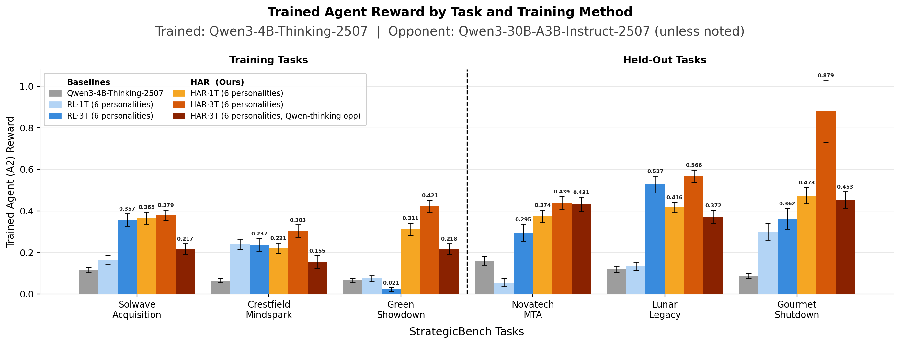
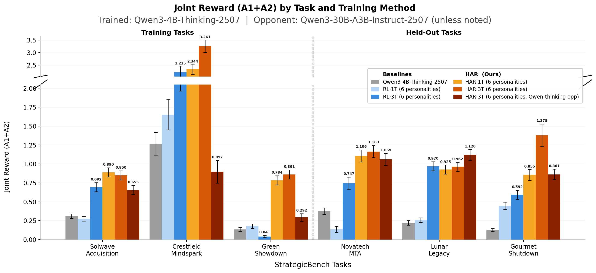
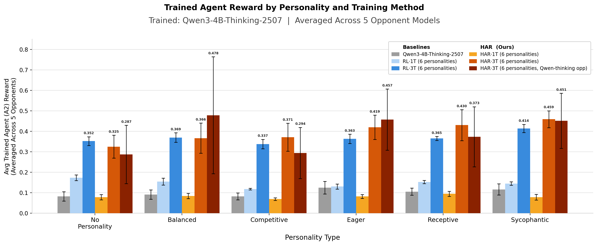
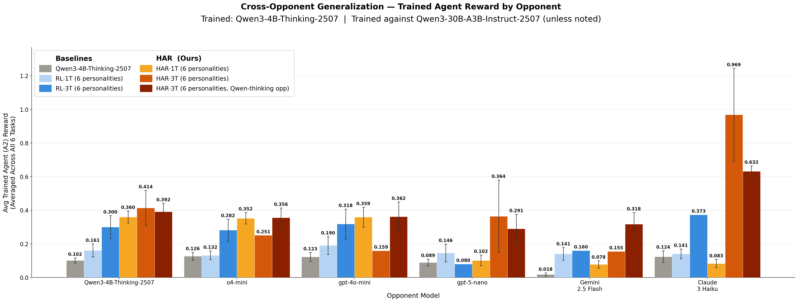

# ICML 2026 Evaluation Results

##  Reviewer 3PjX, #1 Response Figures 

### Figure 1. Trained Agent Reward by Task and Training Method

**Figure 1.** Trained agent (A2) reward across all six StrategicBench tasks. *Left panel:* three training tasks (Solwave Acquisition, Crestfield Mindspark, Green Showdown). *Right panel:* three held-out tasks not seen during training (Novatech MTA, Lunar Legacy, Gourmet Shutdown). HAR·3T consistently exceeds RL·3T on both training and held-out tasks; HAR·3T (Qwen-thinking opp) achieves the highest reward on Gourmet Shutdown (0.879) but with greater variance. Error bars denote ±1 s.e.m.

---

### Figure 2. Joint Reward (A1+A2) by Task and Training Method

**Figure 2.** Joint reward (A1+A2) across six StrategicBench tasks. HAR·3T achieves the highest joint reward on five of six tasks, with the largest absolute gain on Crestfield Mindspark (3.261 vs. ≈2.1 for RL·3T), indicating that HAR training produces more mutually beneficial agreements rather than merely redistributing reward. Error bars denote ±1 s.e.m.

---

### Figure 3. Trained Agent Reward by Personality Type and Training Method

**Figure 3.** Trained agent (A2) reward by personality condition (No Personality, Balanced, Competitive, Eager, Receptive, Sycophantic), averaged across all five external evaluation opponents and all six tasks. HAR·3T consistently outperforms RL·3T across all personality types. HAR·1T (yellow) performs near-zero on most personalities, confirming the importance of multi-task training for personality-conditioned generalisation. Error bars denote ±1 s.e.m.

---

### Figure 4. Cross-Opponent Generalisation — Trained Agent Reward by Opponent

**Figure 4.** Trained agent (A2) mean reward averaged across all six tasks, shown per evaluation opponent. HAR·3T outperforms RL·3T on four of five opponents. The largest gains appear against Claude-3-Haiku (HAR·3T Qwen-thinking opp: 0.969) and the prompted-agent setting (HAR·3T: 0.414). Performance is lowest against Gemini-2.5-Flash-Lite for most configurations. Error bars denote ±1 s.e.m.

---

## Section B — Evaluation Tables

*Full per-task, per-opponent breakdown of all trained policy configurations. **Tr. Opp.** = the model used as training opponent. Columns: Turns = mean conversation length ± std; Agr. Rate = fraction reaching agreement ± std; R₁/R₂ = mean reward ± std for Agent 1 (trained) and Agent 2. Two rows are bolded per table: the **best HAR-family policy** (HAR, GRPO+HAR, HAR+GRPO) and the **best regular RL policy** (GRPO, REINFORCE), both selected by highest **R₂**.*

---

## B.1 — Opponent: Prompted Agent (Qwen3-4B-Thinking-2507)

*Agent 2 is a prompted instance of Qwen3-4B-Thinking-2507 with a distinct negotiation persona.*

### Task: Solwave Acquisition

| Policy | Tr. Opp. | Turns | Agr. Rate | R₁ | R₂ |
|--------|:--------:|------:|----------:|---:|---:|
| Qwen3-4B-Thinking-2507 | Qwen3-30B-A3B-Instruct-2507 | 10.51 ± 0.23 | 27.10% ± 2.40% | 0.195 ± 0.017 | 0.115 ± 0.011 |
| REINFORCE 1T [Sim] | Qwen3-30B-A3B-Instruct-2507 | 7.67 ± 0.51 | 0.00% ± 0.00% | 0.000 ± 0.000 | 0.000 ± 0.000 |
| REINFORCE 1T [HRL] | Qwen3-30B-A3B-Instruct-2507 | 1.00 ± nan | 0.00% ± nan% | 0.000 ± nan | 0.000 ± nan |
| **GRPO 3T ep.1000 [Sim]** | **Qwen3-30B-A3B-Instruct-2507** | **10.23 ± 0.36** | **50.70% ± 4.20%** | **0.335 ± 0.029** | **0.357 ± 0.032** |
| GRPO+HAR 1T ep.360 [Sim] | Qwen3-30B-A3B-Instruct-2507 | 0.00 ± nan | 0.00% ± nan% | 0.000 ± nan | 0.000 ± nan |
| GRPO+HAR 1T ep.360 [HRL] | Qwen3-30B-A3B-Instruct-2507 | 7.94 ± 0.35 | 77.10% ± 3.60% | 0.525 ± 0.027 | 0.365 ± 0.022 |
| GRPO(ε=0.5) 1T ep.240 [Sim] | Qwen3-30B-A3B-Instruct-2507 | 8.86 ± 0.28 | 20.70% ± 3.40% | 0.111 ± 0.019 | 0.165 ± 0.028 |
| GRPO(ε=0.5) 1T ep.240 [Sim] | Qwen3-4B-Thinking-2507 | 9.91 ± 0.22 | 12.60% ± 1.80% | 0.070 ± 0.010 | 0.105 ± 0.015 |
| GRPO(ε=0.5) 3T ep.620 [Sim] | Qwen3-30B-A3B-Instruct-2507 | 6.28 ± 0.25 | 23.20% ± 2.30% | 0.156 ± 0.016 | 0.180 ± 0.019 |
| GRPO(ε=0.5) 1T-NP ep.320 [Sim] | Qwen3-30B-A3B-Instruct-2507 | 6.28 ± 0.23 | 14.60% ± 1.90% | 0.096 ± 0.013 | 0.116 ± 0.015 |
| GRPO(ε=0.5) 1T-NP ep.320 [HRL] | Qwen3-30B-A3B-Instruct-2507 | 1.00 ± 1.00 | 0.00% ± 0.00% | 0.000 ± 0.000 | 0.000 ± 0.000 |
| HAR 3T ep.140 [HRL] | Qwen3-30B-A3B-Instruct-2507 | 10.14 ± 0.34 | 75.70% ± 3.60% | 0.577 ± 0.029 | 0.294 ± 0.018 |
| HAR 3T ep.360 [HRL] | Qwen3-30B-A3B-Instruct-2507 | 7.87 ± 0.53 | 78.60% ± 4.90% | 0.633 ± 0.041 | 0.231 ± 0.018 |
| HAR+GRPO(ε=0.5) 3T ep.620 [HRL] | Qwen3-30B-A3B-Instruct-2507 | 12.83 ± 0.21 | 30.60% ± 2.50% | 0.191 ± 0.016 | 0.217 ± 0.018 |
| **HAR+GRPO(ε=0.5) 3T ep.500 [HRL]** | **Qwen3-4B-Thinking-2507** | **9.75 ± 0.26** | **50.00% ± 2.70%** | **0.276 ± 0.016** | **0.379 ± 0.022** |
| HAR+GRPO(ε=0.5) 1T ep.800 [HRL] | Qwen3-30B-A3B-Instruct-2507 | 7.79 ± 0.28 | 0.00% ± 0.00% | 0.000 ± 0.000 | 0.000 ± 0.000 |
| HAR+GRPO(ε=0.5) 1T ep.920 [Sim] | Qwen3-30B-A3B-Instruct-2507 | 0.00 ± nan | 0.00% ± nan% | 0.000 ± nan | 0.000 ± nan |
| HAR+GRPO(ε=0.5) 1T ep.340 [HRL] | Qwen3-4B-Thinking-2507 | 12.67 ± 0.20 | 0.30% ± 0.30% | 0.002 ± 0.002 | 0.001 ± 0.001 |

**Table 1.** Solwave Acquisition, Opponent: Prompted Agent. Best HAR R₂: **HAR+GRPO(ε=0.5) 3T ep.500 [HRL]** (Qwen3-4B-Thinking-2507 opp, R₂=0.379). Best regular RL R₂: **GRPO 3T ep.1000 [Sim]** (R₂=0.357).

---

### Task: Crestfield Mindspark

| Policy | Tr. Opp. | Turns | Agr. Rate | R₁ | R₂ |
|--------|:--------:|------:|----------:|---:|---:|
| Qwen3-4B-Thinking-2507 | Qwen3-30B-A3B-Instruct-2507 | 8.43 ± 0.25 | 18.00% ± 2.10% | 1.202 ± 0.452 | 0.064 ± 0.009 |
| REINFORCE 1T [Sim] | Qwen3-30B-A3B-Instruct-2507 | 6.07 ± 0.42 | 6.40% ± 2.10% | 0.351 ± 0.321 | 0.028 ± 0.010 |
| GRPO 3T ep.1000 [Sim] | Qwen3-30B-A3B-Instruct-2507 | 12.59 ± 0.32 | 32.10% ± 4.00% | 2.107 ± 1.137 | 0.237 ± 0.031 |
| GRPO+HAR 1T ep.360 [HRL] | Qwen3-30B-A3B-Instruct-2507 | 7.39 ± 0.37 | 72.10% ± 3.80% | 3.040 ± 1.314 | 0.221 ± 0.020 |
| GRPO(ε=0.5) 1T ep.240 [Sim] | Qwen3-30B-A3B-Instruct-2507 | 6.84 ± 0.30 | 41.40% ± 4.20% | 1.976 ± 1.059 | 0.239 ± 0.027 |
| GRPO(ε=0.5) 1T ep.240 [Sim] | Qwen3-4B-Thinking-2507 | 7.25 ± 0.21 | 44.30% ± 2.70% | 1.080 ± 0.488 | 0.209 ± 0.014 |
| GRPO(ε=0.5) 3T ep.620 [Sim] | Qwen3-30B-A3B-Instruct-2507 | 4.82 ± 0.35 | 27.00% ± 4.00% | 0.975 ± 0.451 | 0.269 ± 0.040 |
| **GRPO(ε=0.5) 1T-NP ep.320 [Sim]** | **Qwen3-30B-A3B-Instruct-2507** | **5.34 ± 0.18** | **80.60% ± 2.10%** | **3.024 ± 0.758** | **0.307 ± 0.013** |
| HAR 3T ep.140 [HRL] | Qwen3-30B-A3B-Instruct-2507 | 8.84 ± 0.40 | 71.20% ± 4.10% | 0.479 ± 0.029 | 0.182 ± 0.017 |
| HAR 3T ep.360 [HRL] | Qwen3-30B-A3B-Instruct-2507 | 7.66 ± 0.52 | 74.30% ± 5.30% | 0.422 ± 0.034 | 0.204 ± 0.024 |
| HAR+GRPO(ε=0.5) 3T ep.620 [HRL] | Qwen3-30B-A3B-Instruct-2507 | 12.87 ± 0.20 | 19.10% ± 2.10% | 0.487 ± 0.270 | 0.155 ± 0.018 |
| **HAR+GRPO(ε=0.5) 3T ep.500 [HRL]** | **Qwen3-4B-Thinking-2507** | **10.52 ± 0.26** | **47.70% ± 2.70%** | **0.594 ± 0.218** | **0.303 ± 0.019** |
| HAR+GRPO(ε=0.5) 1T ep.800 [HRL] | Qwen3-30B-A3B-Instruct-2507 | 5.41 ± 0.21 | 17.10% ± 2.00% | 0.084 ± 0.011 | 0.078 ± 0.010 |
| HAR+GRPO(ε=0.5) 1T ep.340 [HRL] | Qwen3-4B-Thinking-2507 | 7.81 ± 0.26 | 1.70% ± 0.70% | 0.011 ± 0.005 | 0.004 ± 0.002 |

**Table 2.** Crestfield Mindspark, Opponent: Prompted Agent. Best HAR R₂: **HAR+GRPO(ε=0.5) 3T ep.500 [HRL]** (Qwen3-4B-Thinking-2507 opp, R₂=0.303). Best regular RL R₂: **GRPO(ε=0.5) 1T-NP ep.320 [Sim]** (R₂=0.307).

---

### Task: Green Showdown

| Policy | Tr. Opp. | Turns | Agr. Rate | R₁ | R₂ |
|--------|:--------:|------:|----------:|---:|---:|
| Qwen3-4B-Thinking-2507 | Qwen3-30B-A3B-Instruct-2507 | 9.25 ± 0.24 | 13.70% ± 1.80% | 0.070 ± 0.012 | 0.065 ± 0.009 |
| REINFORCE 1T [Sim] | Qwen3-30B-A3B-Instruct-2507 | 1.80 ± 0.14 | 5.70% ± 2.00% | 0.030 ± 0.011 | 0.019 ± 0.007 |
| GRPO 3T ep.1000 [Sim] | Qwen3-30B-A3B-Instruct-2507 | 14.49 ± 0.16 | 4.30% ± 1.70% | 0.020 ± 0.008 | 0.021 ± 0.009 |
| GRPO+HAR 1T ep.360 [HRL] | Qwen3-30B-A3B-Instruct-2507 | 3.05 ± 0.21 | 77.10% ± 3.60% | 0.473 ± 0.033 | 0.311 ± 0.018 |
| GRPO(ε=0.5) 1T ep.240 [Sim] | Qwen3-30B-A3B-Instruct-2507 | 3.26 ± 0.15 | 18.60% ± 3.30% | 0.105 ± 0.021 | 0.074 ± 0.014 |
| GRPO(ε=0.5) 1T ep.240 [Sim] | Qwen3-4B-Thinking-2507 | 3.97 ± 0.17 | 12.30% ± 1.80% | 0.064 ± 0.010 | 0.056 ± 0.008 |
| **GRPO(ε=0.5) 3T ep.620 [Sim]** | **Qwen3-30B-A3B-Instruct-2507** | **9.27 ± 0.53** | **20.00% ± 4.80%** | **0.119 ± 0.033** | **0.481 ± 0.116** |
| GRPO(ε=0.5) 1T-NP ep.320 [Sim] | Qwen3-30B-A3B-Instruct-2507 | 3.15 ± 0.12 | 60.00% ± 2.60% | 0.315 ± 0.017 | 0.282 ± 0.013 |
| HAR 3T ep.140 [HRL] | Qwen3-30B-A3B-Instruct-2507 | 5.23 ± 0.39 | 42.90% ± 6.00% | 0.197 ± 0.033 | 0.215 ± 0.031 |
| **HAR 3T ep.360 [HRL]** | **Qwen3-30B-A3B-Instruct-2507** | **2.53 ± 0.22** | **72.90% ± 5.40%** | **0.440 ± 0.046** | **0.466 ± 0.048** |
| HAR+GRPO(ε=0.5) 3T ep.620 [HRL] | Qwen3-30B-A3B-Instruct-2507 | 13.11 ± 0.18 | 19.40% ± 2.10% | 0.178 ± 0.024 | 0.421 ± 0.049 |
| HAR+GRPO(ε=0.5) 3T ep.500 [HRL] | Qwen3-4B-Thinking-2507 | 12.20 ± 0.23 | 12.60% ± 1.80% | 0.074 ± 0.012 | 0.218 ± 0.034 |
| HAR+GRPO(ε=0.5) 1T ep.800 [HRL] | Qwen3-30B-A3B-Instruct-2507 | 1.93 ± 0.06 | 9.10% ± 1.50% | 0.053 ± 0.009 | 0.041 ± 0.007 |
| HAR+GRPO(ε=0.5) 1T ep.340 [HRL] | Qwen3-4B-Thinking-2507 | 3.55 ± 0.14 | 1.40% ± 0.60% | 0.008 ± 0.004 | 0.005 ± 0.003 |

**Table 3.** Green Showdown, Opponent: Prompted Agent. Best HAR R₂: **HAR 3T ep.360 [HRL]** (R₂=0.466). Best regular RL R₂: **GRPO(ε=0.5) 3T ep.620 [Sim]** (R₂=0.481 — highest overall; note high std from small n agreements).

---

### Task: Novatech MTA

| Policy | Tr. Opp. | Turns | Agr. Rate | R₁ | R₂ |
|--------|:--------:|------:|----------:|---:|---:|
| Qwen3-4B-Thinking-2507 | Qwen3-30B-A3B-Instruct-2507 | 8.75 ± 0.21 | 25.70% ± 2.30% | 0.215 ± 0.020 | 0.160 ± 0.015 |
| REINFORCE 1T [Sim] | Qwen3-30B-A3B-Instruct-2507 | 5.99 ± 0.44 | 2.10% ± 1.20% | 0.018 ± 0.010 | 0.013 ± 0.008 |
| GRPO 3T ep.1000 [Sim] | Qwen3-30B-A3B-Instruct-2507 | 4.63 ± 0.24 | 52.10% ± 4.20% | 0.452 ± 0.037 | 0.295 ± 0.026 |
| GRPO+HAR 1T ep.360 [HRL] | Qwen3-30B-A3B-Instruct-2507 | 3.99 ± 0.19 | 89.30% ± 2.60% | 0.732 ± 0.024 | 0.374 ± 0.021 |
| GRPO(ε=0.5) 1T ep.240 [Sim] | Qwen3-30B-A3B-Instruct-2507 | 3.61 ± 0.17 | 10.00% ± 2.50% | 0.082 ± 0.021 | 0.055 ± 0.015 |
| GRPO(ε=0.5) 1T ep.240 [Sim] | Qwen3-4B-Thinking-2507 | 4.43 ± 0.17 | 10.90% ± 1.70% | 0.089 ± 0.014 | 0.062 ± 0.010 |
| GRPO(ε=0.5) 3T ep.620 [Sim] | Qwen3-30B-A3B-Instruct-2507 | 3.34 ± 0.23 | 40.00% ± 5.90% | 0.335 ± 0.050 | 0.230 ± 0.037 |
| **GRPO(ε=0.5) 1T-NP ep.320 [Sim]** | **Qwen3-30B-A3B-Instruct-2507** | **3.77 ± 0.12** | **70.60% ± 2.40%** | **0.596 ± 0.021** | **0.470 ± 0.018** |
| HAR 3T ep.140 [HRL] | Qwen3-30B-A3B-Instruct-2507 | 5.83 ± 0.30 | 90.00% ± 3.60% | 0.733 ± 0.033 | 0.384 ± 0.024 |
| **HAR 3T ep.360 [HRL]** | **Qwen3-30B-A3B-Instruct-2507** | **3.99 ± 0.21** | **95.70% ± 2.40%** | **0.724 ± 0.023** | **0.513 ± 0.024** |
| HAR+GRPO(ε=0.5) 3T ep.620 [HRL] | Qwen3-30B-A3B-Instruct-2507 | 7.25 ± 0.24 | 72.40% ± 2.60% | 0.594 ± 0.022 | 0.439 ± 0.019 |
| HAR+GRPO(ε=0.5) 3T ep.500 [HRL] | Qwen3-4B-Thinking-2507 | 5.30 ± 0.18 | 77.70% ± 2.20% | 0.628 ± 0.019 | 0.431 ± 0.015 |
| HAR+GRPO(ε=0.5) 1T ep.800 [HRL] | Qwen3-30B-A3B-Instruct-2507 | 2.61 ± 0.09 | 16.60% ± 2.00% | 0.141 ± 0.017 | 0.089 ± 0.011 |
| HAR+GRPO(ε=0.5) 1T ep.340 [HRL] | Qwen3-4B-Thinking-2507 | 5.75 ± 0.20 | 1.10% ± 0.60% | 0.009 ± 0.004 | 0.005 ± 0.003 |

**Table 4.** Novatech MTA, Opponent: Prompted Agent. Best HAR R₂: **HAR 3T ep.360 [HRL]** (R₂=0.513). Best regular RL R₂: **GRPO(ε=0.5) 1T-NP ep.320 [Sim]** (R₂=0.470).

---

### Task: Lunar Legacy

| Policy | Tr. Opp. | Turns | Agr. Rate | R₁ | R₂ |
|--------|:--------:|------:|----------:|---:|---:|
| Qwen3-4B-Thinking-2507 | Qwen3-30B-A3B-Instruct-2507 | 5.43 ± 0.17 | 23.30% ± 2.40% | 0.103 ± 0.012 | 0.119 ± 0.013 |
| REINFORCE 1T [Sim] | Qwen3-30B-A3B-Instruct-2507 | 4.96 ± 0.44 | 23.60% ± 3.60% | 0.125 ± 0.021 | 0.139 ± 0.022 |
| **GRPO 3T ep.1000 [Sim]** | **Qwen3-30B-A3B-Instruct-2507** | **4.71 ± 0.21** | **79.30% ± 3.40%** | **0.443 ± 0.023** | **0.527 ± 0.026** |
| GRPO+HAR 1T ep.360 [HRL] | Qwen3-30B-A3B-Instruct-2507 | 3.94 ± 0.20 | 84.30% ± 3.10% | 0.509 ± 0.024 | 0.416 ± 0.019 |
| GRPO(ε=0.5) 1T ep.240 [Sim] | Qwen3-30B-A3B-Instruct-2507 | 4.16 ± 0.19 | 21.40% ± 3.50% | 0.125 ± 0.022 | 0.134 ± 0.023 |
| GRPO(ε=0.5) 1T ep.240 [Sim] | Qwen3-4B-Thinking-2507 | 4.70 ± 0.18 | 26.60% ± 2.40% | 0.155 ± 0.015 | 0.165 ± 0.016 |
| GRPO(ε=0.5) 3T ep.620 [Sim] | Qwen3-30B-A3B-Instruct-2507 | 3.94 ± 0.28 | 72.90% ± 5.40% | 0.377 ± 0.034 | −2.088 ± 2.535 |
| GRPO(ε=0.5) 1T-NP ep.320 [Sim] | Qwen3-30B-A3B-Instruct-2507 | 4.15 ± 0.16 | 66.00% ± 2.50% | 0.399 ± 0.017 | 0.472 ± 0.019 |
| HAR 3T ep.140 [HRL] | Qwen3-30B-A3B-Instruct-2507 | 6.00 ± 0.32 | 95.70% ± 2.40% | 0.453 ± 0.020 | 0.518 ± 0.027 |
| HAR 3T ep.360 [HRL] | Qwen3-30B-A3B-Instruct-2507 | 3.36 ± 0.24 | 94.30% ± 2.80% | 0.590 ± 0.029 | 0.446 ± 0.019 |
| HAR+GRPO(ε=0.5) 3T ep.620 [HRL] | Qwen3-30B-A3B-Instruct-2507 | 7.65 ± 0.30 | 67.90% ± 2.80% | 0.379 ± 0.018 | 0.372 ± 0.018 |
| **HAR+GRPO(ε=0.5) 3T ep.500 [HRL]** | **Qwen3-4B-Thinking-2507** | **5.42 ± 0.21** | **90.00% ± 1.60%** | **0.554 ± 0.014** | **0.566 ± 0.014** |
| HAR+GRPO(ε=0.5) 1T ep.800 [HRL] | Qwen3-30B-A3B-Instruct-2507 | 2.34 ± 0.09 | 30.00% ± 2.50% | 0.158 ± 0.014 | 0.164 ± 0.014 |
| HAR+GRPO(ε=0.5) 1T ep.340 [HRL] | Qwen3-4B-Thinking-2507 | 5.83 ± 0.22 | 3.10% ± 0.90% | 0.016 ± 0.005 | 0.016 ± 0.005 |

**Table 5.** Lunar Legacy, Opponent: Prompted Agent. Best HAR R₂: **HAR+GRPO(ε=0.5) 3T ep.500 [HRL]** (Qwen3-4B-Thinking-2507 opp, R₂=0.566). Best regular RL R₂: **GRPO 3T ep.1000 [Sim]** (R₂=0.527). Note: GRPO(ε=0.5) 3T ep.620 [Sim] shows anomalous negative R₂ (−2.088 ± 2.535).

---

### Task: Gourmet Shutdown

| Policy | Tr. Opp. | Turns | Agr. Rate | R₁ | R₂ |
|--------|:--------:|------:|----------:|---:|---:|
| Qwen3-4B-Thinking-2507 | Qwen3-30B-A3B-Instruct-2507 | 8.20 ± 0.21 | 10.70% ± 1.90% | 0.038 ± 0.007 | 0.087 ± 0.015 |
| REINFORCE 1T [Sim] | Qwen3-30B-A3B-Instruct-2507 | 2.96 ± 0.21 | 13.60% ± 2.90% | 0.054 ± 0.013 | 0.101 ± 0.023 |
| GRPO 3T ep.1000 [Sim] | Qwen3-30B-A3B-Instruct-2507 | 9.45 ± 0.32 | 52.10% ± 4.20% | 0.230 ± 0.022 | 0.362 ± 0.032 |
| GRPO+HAR 1T ep.360 [HRL] | Qwen3-30B-A3B-Instruct-2507 | 4.88 ± 0.28 | 87.10% ± 2.80% | 0.382 ± 0.019 | 0.473 ± 0.020 |
| GRPO(ε=0.5) 1T ep.240 [Sim] | Qwen3-30B-A3B-Instruct-2507 | 4.17 ± 0.20 | 36.40% ± 4.10% | 0.145 ± 0.022 | 0.300 ± 0.035 |
| GRPO(ε=0.5) 1T ep.240 [Sim] | Qwen3-4B-Thinking-2507 | 4.51 ± 0.16 | 30.90% ± 2.50% | 0.119 ± 0.010 | 0.250 ± 0.021 |
| GRPO(ε=0.5) 3T ep.620 [Sim] | Qwen3-30B-A3B-Instruct-2507 | 5.04 ± 0.66 | 34.60% ± 9.50% | 0.103 ± 0.036 | 0.524 ± 0.230 |
| **GRPO(ε=0.5) 1T-NP ep.320 [Sim]** | **Qwen3-30B-A3B-Instruct-2507** | **4.60 ± 0.18** | **73.70% ± 2.40%** | **0.308 ± 0.014** | **0.528 ± 0.020** |
| HAR 3T ep.140 [HRL] | Qwen3-30B-A3B-Instruct-2507 | 7.69 ± 0.42 | 81.40% ± 4.70% | 0.328 ± 0.039 | 0.503 ± 0.036 |
| HAR 3T ep.360 [HRL] | Qwen3-30B-A3B-Instruct-2507 | 5.09 ± 0.42 | 90.00% ± 3.60% | 0.499 ± 0.030 | 0.474 ± 0.026 |
| **HAR+GRPO(ε=0.5) 3T ep.620 [HRL]** | **Qwen3-30B-A3B-Instruct-2507** | **10.81 ± 0.28** | **40.70% ± 2.90%** | **0.505 ± 0.118** | **0.879 ± 0.177** |
| HAR+GRPO(ε=0.5) 3T ep.500 [HRL] | Qwen3-4B-Thinking-2507 | 7.45 ± 0.24 | 73.10% ± 2.40% | 0.408 ± 0.022 | 0.453 ± 0.022 |
| HAR+GRPO(ε=0.5) 1T ep.800 [HRL] | Qwen3-30B-A3B-Instruct-2507 | 3.94 ± 0.16 | 16.90% ± 2.00% | 0.063 ± 0.008 | 0.102 ± 0.013 |
| HAR+GRPO(ε=0.5) 1T ep.340 [HRL] | Qwen3-4B-Thinking-2507 | 4.53 ± 0.19 | 6.90% ± 1.40% | 0.024 ± 0.005 | 0.042 ± 0.009 |

**Table 6.** Gourmet Shutdown, Opponent: Prompted Agent. Best HAR R₂: **HAR+GRPO(ε=0.5) 3T ep.620 [HRL]** (R₂=0.879). Best regular RL R₂: **GRPO(ε=0.5) 1T-NP ep.320 [Sim]** (R₂=0.528).

---

## B.2 — Opponent: o4-mini

### Task: Solwave Acquisition

| Policy | Tr. Opp. | Turns | Agr. Rate | R₁ | R₂ |
|--------|:--------:|------:|----------:|---:|---:|
| Qwen3-4B-Thinking-2507 | Qwen3-30B-A3B-Instruct-2507 | 6.64 ± 0.40 | 34.30% ± 5.70% | 0.260 ± 0.044 | 0.145 ± 0.027 |
| REINFORCE 1T [Sim] | Qwen3-30B-A3B-Instruct-2507 | 7.71 ± 0.72 | 0.00% ± 0.00% | 0.000 ± 0.000 | 0.000 ± 0.000 |
| REINFORCE 1T [HRL] | Qwen3-30B-A3B-Instruct-2507 | 1.00 ± nan | 0.00% ± nan% | 0.000 ± nan | 0.000 ± nan |
| **GRPO 3T ep.1000 [Sim]** | **Qwen3-30B-A3B-Instruct-2507** | **10.19 ± 0.57** | **34.30% ± 5.70%** | **0.235 ± 0.040** | **0.190 ± 0.034** |
| GRPO+HAR 1T ep.360 [HRL] | Qwen3-30B-A3B-Instruct-2507 | 6.07 ± 0.43 | 75.70% ± 5.20% | 0.569 ± 0.042 | 0.262 ± 0.022 |
| GRPO(ε=0.5) 1T ep.240 [Sim] | Qwen3-30B-A3B-Instruct-2507 | 8.70 ± 0.46 | 17.10% ± 4.50% | 0.105 ± 0.029 | 0.120 ± 0.033 |
| GRPO(ε=0.5) 1T ep.240 [Sim] | Qwen3-4B-Thinking-2507 | 9.40 ± 0.42 | 15.70% ± 4.40% | 0.085 ± 0.024 | 0.120 ± 0.034 |
| GRPO(ε=0.5) 3T ep.620 [Sim] | Qwen3-30B-A3B-Instruct-2507 | 8.26 ± 0.59 | 27.10% ± 5.40% | 0.196 ± 0.040 | 0.190 ± 0.039 |
| GRPO(ε=0.5) 1T-NP ep.320 [Sim] | Qwen3-30B-A3B-Instruct-2507 | 5.99 ± 0.47 | 18.60% ± 4.70% | 0.126 ± 0.033 | 0.126 ± 0.034 |
| GRPO(ε=0.5) 1T-NP ep.320 [HRL] | Qwen3-30B-A3B-Instruct-2507 | 2.00 ± nan | 0.00% ± nan% | 0.000 ± nan | 0.000 ± nan |
| HAR 3T ep.140 [HRL] | Qwen3-30B-A3B-Instruct-2507 | 8.70 ± 0.54 | 71.40% ± 5.40% | 0.566 ± 0.044 | 0.220 ± 0.020 |
| HAR 3T ep.360 [HRL] | Qwen3-30B-A3B-Instruct-2507 | 7.87 ± 0.53 | 78.60% ± 4.90% | 0.633 ± 0.041 | 0.231 ± 0.018 |
| HAR+GRPO(ε=0.5) 3T ep.620 [HRL] | Qwen3-30B-A3B-Instruct-2507 | 14.34 ± 0.26 | 18.60% ± 4.70% | 0.133 ± 0.034 | 0.104 ± 0.028 |
| **HAR+GRPO(ε=0.5) 3T ep.500 [HRL]** | **Qwen3-4B-Thinking-2507** | **8.16 ± 0.50** | **65.70% ± 5.70%** | **0.394 ± 0.040** | **0.388 ± 0.039** |
| HAR+GRPO(ε=0.5) 1T ep.800 [HRL] | Qwen3-30B-A3B-Instruct-2507 | 8.31 ± 0.51 | 0.00% ± 0.00% | 0.000 ± 0.000 | 0.000 ± 0.000 |
| HAR+GRPO(ε=0.5) 1T ep.920 [Sim] | Qwen3-30B-A3B-Instruct-2507 | 0.00 ± nan | 0.00% ± nan% | 0.000 ± nan | 0.000 ± nan |
| HAR+GRPO(ε=0.5) 1T ep.340 [HRL] | Qwen3-4B-Thinking-2507 | 8.93 ± 0.49 | 1.40% ± 1.40% | 0.010 ± 0.010 | 0.005 ± 0.005 |

**Table 7.** Solwave Acquisition, Opponent: o4-mini. Best HAR R₂: **HAR+GRPO(ε=0.5) 3T ep.500 [HRL]** (Qwen3-4B-Thinking-2507 opp, R₂=0.388). Best regular RL R₂: **GRPO 3T ep.1000 [Sim]** (R₂=0.190).

---

### Task: Crestfield Mindspark

| Policy | Tr. Opp. | Turns | Agr. Rate | R₁ | R₂ |
|--------|:--------:|------:|----------:|---:|---:|
| Qwen3-4B-Thinking-2507 | Qwen3-30B-A3B-Instruct-2507 | 7.40 ± 0.52 | 25.70% ± 5.30% | 1.266 ± 1.115 | 0.085 ± 0.023 |
| REINFORCE 1T [Sim] | Qwen3-30B-A3B-Instruct-2507 | 5.47 ± 0.56 | 7.10% ± 3.10% | 0.042 ± 0.018 | 0.025 ± 0.012 |
| **GRPO 3T ep.1000 [Sim]** | **Qwen3-30B-A3B-Instruct-2507** | **10.87 ± 0.50** | **47.10% ± 6.00%** | **4.104 ± 2.256** | **0.343 ± 0.048** |
| GRPO+HAR 1T ep.360 [HRL] | Qwen3-30B-A3B-Instruct-2507 | 6.07 ± 0.46 | 78.60% ± 4.90% | 0.457 ± 0.033 | 0.246 ± 0.034 |
| GRPO(ε=0.5) 1T ep.240 [Sim] | Qwen3-30B-A3B-Instruct-2507 | 6.16 ± 0.46 | 38.60% ± 5.90% | 2.424 ± 1.705 | 0.204 ± 0.036 |
| GRPO(ε=0.5) 1T ep.240 [Sim] | Qwen3-4B-Thinking-2507 | 5.97 ± 0.39 | 50.00% ± 6.00% | 0.267 ± 0.034 | 0.191 ± 0.028 |
| GRPO(ε=0.5) 1T-NP ep.320 [Sim] | Qwen3-30B-A3B-Instruct-2507 | 4.49 ± 0.31 | 77.10% ± 5.10% | 1.439 ± 0.953 | 0.255 ± 0.033 |
| HAR 3T ep.140 [HRL] | Qwen3-30B-A3B-Instruct-2507 | 6.62 ± 0.58 | 76.40% ± 5.80% | 0.479 ± 0.041 | 0.203 ± 0.030 |
| HAR 3T ep.360 [HRL] | Qwen3-30B-A3B-Instruct-2507 | 7.66 ± 0.52 | 74.30% ± 5.30% | 0.422 ± 0.034 | 0.204 ± 0.024 |
| HAR+GRPO(ε=0.5) 3T ep.620 [HRL] | Qwen3-30B-A3B-Instruct-2507 | 11.83 ± 0.53 | 22.90% ± 5.10% | 1.064 ± 0.957 | 0.188 ± 0.044 |
| **HAR+GRPO(ε=0.5) 3T ep.500 [HRL]** | **Qwen3-4B-Thinking-2507** | **9.66 ± 0.59** | **45.70% ± 6.00%** | **0.243 ± 0.035** | **0.289 ± 0.048** |
| HAR+GRPO(ε=0.5) 1T ep.800 [HRL] | Qwen3-30B-A3B-Instruct-2507 | 5.20 ± 0.49 | 10.00% ± 3.60% | 0.041 ± 0.016 | 0.036 ± 0.014 |
| HAR+GRPO(ε=0.5) 1T ep.340 [HRL] | Qwen3-4B-Thinking-2507 | 5.46 ± 0.45 | 0.00% ± 0.00% | 0.000 ± 0.000 | 0.000 ± 0.000 |

**Table 8.** Crestfield Mindspark, Opponent: o4-mini. Best HAR R₂: **HAR+GRPO(ε=0.5) 3T ep.500 [HRL]** (Qwen3-4B-Thinking-2507 opp, R₂=0.289). Best regular RL R₂: **GRPO 3T ep.1000 [Sim]** (R₂=0.343).

---

### Task: Green Showdown

| Policy | Tr. Opp. | Turns | Agr. Rate | R₁ | R₂ |
|--------|:--------:|------:|----------:|---:|---:|
| Qwen3-4B-Thinking-2507 | Qwen3-30B-A3B-Instruct-2507 | 6.61 ± 0.35 | 31.40% ± 5.60% | 0.153 ± 0.031 | 0.145 ± 0.026 |
| REINFORCE 1T [Sim] | Qwen3-30B-A3B-Instruct-2507 | 1.60 ± 0.13 | 8.60% ± 3.40% | 0.049 ± 0.019 | 0.029 ± 0.011 |
| GRPO 3T ep.1000 [Sim] | Qwen3-30B-A3B-Instruct-2507 | 14.26 ± 0.24 | 8.60% ± 3.40% | 0.040 ± 0.016 | 0.043 ± 0.018 |
| GRPO+HAR 1T ep.360 [HRL] | Qwen3-30B-A3B-Instruct-2507 | 1.93 ± 0.11 | 91.40% ± 3.40% | 0.505 ± 0.030 | 0.341 ± 0.020 |
| GRPO(ε=0.5) 1T ep.240 [Sim] | Qwen3-30B-A3B-Instruct-2507 | 2.49 ± 0.18 | 22.90% ± 5.10% | 0.120 ± 0.027 | 0.081 ± 0.019 |
| GRPO(ε=0.5) 1T ep.240 [Sim] | Qwen3-4B-Thinking-2507 | 2.04 ± 0.12 | 11.40% ± 3.80% | 0.069 ± 0.023 | 0.044 ± 0.015 |
| **GRPO(ε=0.5) 1T-NP ep.320 [Sim]** | **Qwen3-30B-A3B-Instruct-2507** | **2.00 ± 0.08** | **64.30% ± 5.80%** | **0.409 ± 0.046** | **0.257 ± 0.027** |
| **HAR 3T ep.360 [HRL]** | **Qwen3-30B-A3B-Instruct-2507** | **2.53 ± 0.22** | **72.90% ± 5.40%** | **0.440 ± 0.046** | **0.466 ± 0.048** |
| HAR+GRPO(ε=0.5) 3T ep.620 [HRL] | Qwen3-30B-A3B-Instruct-2507 | 12.44 ± 0.42 | 20.00% ± 4.80% | 0.128 ± 0.037 | 0.181 ± 0.062 |
| HAR+GRPO(ε=0.5) 3T ep.500 [HRL] | Qwen3-4B-Thinking-2507 | 8.34 ± 0.56 | 12.90% ± 4.00% | 0.059 ± 0.020 | 0.113 ± 0.041 |
| HAR+GRPO(ε=0.5) 1T ep.800 [HRL] | Qwen3-30B-A3B-Instruct-2507 | 1.23 ± 0.05 | 4.30% ± 2.40% | 0.026 ± 0.015 | 0.017 ± 0.010 |
| HAR+GRPO(ε=0.5) 1T ep.340 [HRL] | Qwen3-4B-Thinking-2507 | 1.80 ± 0.09 | 1.40% ± 1.40% | 0.009 ± 0.009 | 0.005 ± 0.005 |

**Table 9.** Green Showdown, Opponent: o4-mini. Best HAR R₂: **HAR 3T ep.360 [HRL]** (R₂=0.466). Best regular RL R₂: **GRPO(ε=0.5) 1T-NP ep.320 [Sim]** (R₂=0.257).

---

### Task: Novatech MTA

| Policy | Tr. Opp. | Turns | Agr. Rate | R₁ | R₂ |
|--------|:--------:|------:|----------:|---:|---:|
| Qwen3-4B-Thinking-2507 | Qwen3-30B-A3B-Instruct-2507 | 7.60 ± 0.46 | 22.90% ± 5.10% | 0.182 ± 0.041 | 0.154 ± 0.036 |
| REINFORCE 1T [Sim] | Qwen3-30B-A3B-Instruct-2507 | 5.06 ± 0.53 | 0.00% ± 0.00% | 0.000 ± 0.000 | 0.000 ± 0.000 |
| GRPO 3T ep.1000 [Sim] | Qwen3-30B-A3B-Instruct-2507 | 3.69 ± 0.29 | 50.00% ± 6.00% | 0.425 ± 0.052 | 0.272 ± 0.035 |
| GRPO+HAR 1T ep.360 [HRL] | Qwen3-30B-A3B-Instruct-2507 | 3.36 ± 0.30 | 90.00% ± 3.60% | 0.702 ± 0.032 | 0.414 ± 0.030 |
| GRPO(ε=0.5) 1T ep.240 [Sim] | Qwen3-30B-A3B-Instruct-2507 | 2.70 ± 0.15 | 11.40% ± 3.80% | 0.093 ± 0.032 | 0.059 ± 0.021 |
| GRPO(ε=0.5) 1T ep.240 [Sim] | Qwen3-4B-Thinking-2507 | 2.69 ± 0.19 | 15.70% ± 4.40% | 0.127 ± 0.036 | 0.098 ± 0.029 |
| **GRPO(ε=0.5) 1T-NP ep.320 [Sim]** | **Qwen3-30B-A3B-Instruct-2507** | **2.70 ± 0.12** | **64.30% ± 5.80%** | **0.526 ± 0.049** | **0.411 ± 0.041** |
| **HAR 3T ep.360 [HRL]** | **Qwen3-30B-A3B-Instruct-2507** | **3.99 ± 0.21** | **95.70% ± 2.40%** | **0.724 ± 0.023** | **0.513 ± 0.024** |
| HAR+GRPO(ε=0.5) 3T ep.620 [HRL] | Qwen3-30B-A3B-Instruct-2507 | 5.09 ± 0.29 | 78.60% ± 4.90% | 0.623 ± 0.041 | 0.486 ± 0.038 |
| HAR+GRPO(ε=0.5) 3T ep.500 [HRL] | Qwen3-4B-Thinking-2507 | 3.61 ± 0.23 | 78.60% ± 4.90% | 0.610 ± 0.040 | 0.468 ± 0.035 |
| HAR+GRPO(ε=0.5) 1T ep.800 [HRL] | Qwen3-30B-A3B-Instruct-2507 | 2.06 ± 0.12 | 18.60% ± 4.70% | 0.149 ± 0.038 | 0.105 ± 0.028 |
| HAR+GRPO(ε=0.5) 1T ep.340 [HRL] | Qwen3-4B-Thinking-2507 | 3.41 ± 0.22 | 0.00% ± 0.00% | 0.000 ± 0.000 | 0.000 ± 0.000 |

**Table 10.** Novatech MTA, Opponent: o4-mini. Best HAR R₂: **HAR 3T ep.360 [HRL]** (R₂=0.513). Best regular RL R₂: **GRPO(ε=0.5) 1T-NP ep.320 [Sim]** (R₂=0.411).

---

### Task: Lunar Legacy

| Policy | Tr. Opp. | Turns | Agr. Rate | R₁ | R₂ |
|--------|:--------:|------:|----------:|---:|---:|
| Qwen3-4B-Thinking-2507 | Qwen3-30B-A3B-Instruct-2507 | 4.00 ± 0.23 | 38.60% ± 5.90% | 0.207 ± 0.034 | 0.196 ± 0.033 |
| REINFORCE 1T [Sim] | Qwen3-30B-A3B-Instruct-2507 | 4.60 ± 0.61 | 28.60% ± 5.40% | 0.172 ± 0.034 | 0.182 ± 0.036 |
| **GRPO 3T ep.1000 [Sim]** | **Qwen3-30B-A3B-Instruct-2507** | **3.24 ± 0.17** | **85.70% ± 4.20%** | **0.517 ± 0.032** | **0.521 ± 0.032** |
| GRPO+HAR 1T ep.360 [HRL] | Qwen3-30B-A3B-Instruct-2507 | 2.66 ± 0.21 | 82.90% ± 4.50% | 0.557 ± 0.035 | 0.401 ± 0.025 |
| GRPO(ε=0.5) 1T ep.240 [Sim] | Qwen3-30B-A3B-Instruct-2507 | 3.17 ± 0.23 | 20.00% ± 4.80% | 0.128 ± 0.033 | 0.119 ± 0.030 |
| GRPO(ε=0.5) 1T ep.240 [Sim] | Qwen3-4B-Thinking-2507 | 2.86 ± 0.19 | 28.60% ± 5.40% | 0.201 ± 0.040 | 0.185 ± 0.037 |
| GRPO(ε=0.5) 1T-NP ep.320 [Sim] | Qwen3-30B-A3B-Instruct-2507 | 2.54 ± 0.13 | 62.90% ± 5.80% | 0.425 ± 0.042 | 0.446 ± 0.044 |
| HAR 3T ep.360 [HRL] | Qwen3-30B-A3B-Instruct-2507 | 3.36 ± 0.24 | 94.30% ± 2.80% | 0.590 ± 0.029 | 0.446 ± 0.019 |
| HAR+GRPO(ε=0.5) 3T ep.620 [HRL] | Qwen3-30B-A3B-Instruct-2507 | 5.00 ± 0.40 | 78.60% ± 4.90% | 0.516 ± 0.036 | 0.414 ± 0.033 |
| **HAR+GRPO(ε=0.5) 3T ep.500 [HRL]** | **Qwen3-4B-Thinking-2507** | **2.54 ± 0.14** | **92.90% ± 3.10%** | **0.622 ± 0.028** | **0.511 ± 0.025** |
| HAR+GRPO(ε=0.5) 1T ep.800 [HRL] | Qwen3-30B-A3B-Instruct-2507 | 1.86 ± 0.07 | 32.90% ± 5.70% | 0.227 ± 0.041 | 0.192 ± 0.034 |
| HAR+GRPO(ε=0.5) 1T ep.340 [HRL] | Qwen3-4B-Thinking-2507 | 2.87 ± 0.27 | 4.30% ± 2.40% | 0.016 ± 0.010 | 0.028 ± 0.016 |

**Table 11.** Lunar Legacy, Opponent: o4-mini. Best HAR R₂: **HAR+GRPO(ε=0.5) 3T ep.500 [HRL]** (Qwen3-4B-Thinking-2507 opp, R₂=0.511). Best regular RL R₂: **GRPO 3T ep.1000 [Sim]** (R₂=0.521).

---

### Task: Gourmet Shutdown

| Policy | Tr. Opp. | Turns | Agr. Rate | R₁ | R₂ |
|--------|:--------:|------:|----------:|---:|---:|
| Qwen3-4B-Thinking-2507 | Qwen3-30B-A3B-Instruct-2507 | 6.71 ± 0.39 | 5.70% ± 2.80% | 0.025 ± 0.012 | 0.033 ± 0.016 |
| REINFORCE 1T [Sim] | Qwen3-30B-A3B-Instruct-2507 | 2.74 ± 0.27 | 14.30% ± 4.20% | 0.067 ± 0.021 | 0.086 ± 0.027 |
| GRPO 3T ep.1000 [Sim] | Qwen3-30B-A3B-Instruct-2507 | 9.40 ± 0.47 | 54.30% ± 6.00% | 0.294 ± 0.035 | 0.320 ± 0.038 |
| GRPO+HAR 1T ep.360 [HRL] | Qwen3-30B-A3B-Instruct-2507 | 3.20 ± 0.29 | 94.30% ± 2.80% | 0.482 ± 0.024 | 0.450 ± 0.020 |
| GRPO(ε=0.5) 1T ep.240 [Sim] | Qwen3-30B-A3B-Instruct-2507 | 3.60 ± 0.31 | 30.00% ± 5.50% | 0.114 ± 0.023 | 0.211 ± 0.041 |
| GRPO(ε=0.5) 1T ep.240 [Sim] | Qwen3-4B-Thinking-2507 | 3.70 ± 0.29 | 31.40% ± 5.60% | 0.146 ± 0.027 | 0.213 ± 0.041 |
| **GRPO(ε=0.5) 1T-NP ep.320 [Sim]** | **Qwen3-30B-A3B-Instruct-2507** | **3.16 ± 0.20** | **77.10% ± 5.10%** | **0.404 ± 0.032** | **0.465 ± 0.040** |
| **HAR 3T ep.360 [HRL]** | **Qwen3-30B-A3B-Instruct-2507** | **5.09 ± 0.42** | **90.00% ± 3.60%** | **0.499 ± 0.030** | **0.474 ± 0.026** |
| HAR+GRPO(ε=0.5) 3T ep.620 [HRL] | Qwen3-30B-A3B-Instruct-2507 | 11.91 ± 0.53 | 20.00% ± 4.80% | 0.174 ± 0.085 | 0.133 ± 0.041 |
| HAR+GRPO(ε=0.5) 3T ep.500 [HRL] | Qwen3-4B-Thinking-2507 | 7.79 ± 0.53 | 74.30% ± 5.30% | 0.484 ± 0.057 | 0.365 ± 0.029 |
| HAR+GRPO(ε=0.5) 1T ep.800 [HRL] | Qwen3-30B-A3B-Instruct-2507 | 3.37 ± 0.27 | 14.30% ± 4.20% | 0.058 ± 0.020 | 0.079 ± 0.025 |
| HAR+GRPO(ε=0.5) 1T ep.340 [HRL] | Qwen3-4B-Thinking-2507 | 3.10 ± 0.18 | 7.10% ± 3.10% | 0.023 ± 0.010 | 0.042 ± 0.019 |

**Table 12.** Gourmet Shutdown, Opponent: o4-mini. Best HAR R₂: **HAR 3T ep.360 [HRL]** (R₂=0.474). Best regular RL R₂: **GRPO(ε=0.5) 1T-NP ep.320 [Sim]** (R₂=0.465).

---

## B.3 — Opponent: GPT-4o-mini

### Task: Solwave Acquisition

| Policy | Tr. Opp. | Turns | Agr. Rate | R₁ | R₂ |
|--------|:--------:|------:|----------:|---:|---:|
| Qwen3-4B-Thinking-2507 | Qwen3-30B-A3B-Instruct-2507 | 11.16 ± 0.43 | 40.00% ± 5.90% | 0.272 ± 0.041 | 0.177 ± 0.028 |
| REINFORCE 1T [Sim] | Qwen3-30B-A3B-Instruct-2507 | 7.63 ± 0.71 | 0.00% ± 0.00% | 0.000 ± 0.000 | 0.000 ± 0.000 |
| **GRPO 3T ep.1000 [Sim]** | **Qwen3-30B-A3B-Instruct-2507** | **10.27 ± 0.45** | **67.10% ± 5.70%** | **0.435 ± 0.038** | **0.523 ± 0.046** |
| GRPO+HAR 1T ep.360 [Sim] | Qwen3-30B-A3B-Instruct-2507 | 0.00 ± nan | 0.00% ± nan% | 0.000 ± nan | 0.000 ± nan |
| GRPO+HAR 1T ep.360 [HRL] | Qwen3-30B-A3B-Instruct-2507 | 9.80 ± 0.46 | 78.60% ± 4.90% | 0.482 ± 0.033 | 0.468 ± 0.034 |
| GRPO(ε=0.5) 1T ep.240 [Sim] | Qwen3-30B-A3B-Instruct-2507 | 9.03 ± 0.34 | 24.30% ± 5.20% | 0.117 ± 0.026 | 0.209 ± 0.045 |
| GRPO(ε=0.5) 1T ep.240 [Sim] | Qwen3-4B-Thinking-2507 | 8.43 ± 0.33 | 18.60% ± 4.70% | 0.104 ± 0.027 | 0.165 ± 0.042 |
| GRPO(ε=0.5) 3T ep.620 [Sim] | Qwen3-30B-A3B-Instruct-2507 | 4.89 ± 0.46 | 17.70% ± 4.90% | 0.111 ± 0.031 | 0.150 ± 0.041 |
| GRPO(ε=0.5) 1T-NP ep.320 [Sim] | Qwen3-30B-A3B-Instruct-2507 | 4.61 ± 0.18 | 15.70% ± 4.40% | 0.104 ± 0.029 | 0.135 ± 0.038 |
| GRPO(ε=0.5) 1T-NP ep.320 [HRL] | Qwen3-30B-A3B-Instruct-2507 | 0.00 ± nan | 0.00% ± nan% | 0.000 ± nan | 0.000 ± nan |
| HAR 3T ep.140 [HRL] | Qwen3-30B-A3B-Instruct-2507 | 11.59 ± 0.36 | 80.00% ± 4.80% | 0.589 ± 0.036 | 0.367 ± 0.027 |
| HAR+GRPO(ε=0.5) 3T ep.620 [HRL] | Qwen3-30B-A3B-Instruct-2507 | 14.07 ± 0.30 | 32.90% ± 5.70% | 0.201 ± 0.035 | 0.230 ± 0.040 |
| **HAR+GRPO(ε=0.5) 3T ep.500 [HRL]** | **Qwen3-4B-Thinking-2507** | **7.34 ± 0.37** | **67.10% ± 5.70%** | **0.362 ± 0.034** | **0.535 ± 0.047** |
| HAR+GRPO(ε=0.5) 1T ep.800 [HRL] | Qwen3-30B-A3B-Instruct-2507 | 5.57 ± 0.39 | 0.00% ± 0.00% | 0.000 ± 0.000 | 0.000 ± 0.000 |
| HAR+GRPO(ε=0.5) 1T ep.340 [HRL] | Qwen3-4B-Thinking-2507 | 14.76 ± 0.20 | 0.00% ± 0.00% | 0.000 ± 0.000 | 0.000 ± 0.000 |

**Table 13.** Solwave Acquisition, Opponent: GPT-4o-mini. Best HAR R₂: **HAR+GRPO(ε=0.5) 3T ep.500 [HRL]** (Qwen3-4B-Thinking-2507 opp, R₂=0.535). Best regular RL R₂: **GRPO 3T ep.1000 [Sim]** (R₂=0.523).

---

### Task: Crestfield Mindspark

| Policy | Tr. Opp. | Turns | Agr. Rate | R₁ | R₂ |
|--------|:--------:|------:|----------:|---:|---:|
| Qwen3-4B-Thinking-2507 | Qwen3-30B-A3B-Instruct-2507 | 9.63 ± 0.62 | 12.90% ± 4.00% | 0.065 ± 0.021 | 0.032 ± 0.013 |
| REINFORCE 1T [Sim] | Qwen3-30B-A3B-Instruct-2507 | 6.67 ± 0.63 | 5.70% ± 2.80% | 0.660 ± 0.642 | 0.031 ± 0.016 |
| GRPO 3T ep.1000 [Sim] | Qwen3-30B-A3B-Instruct-2507 | 14.30 ± 0.26 | 17.10% ± 4.50% | 0.109 ± 0.030 | 0.130 ± 0.035 |
| **GRPO+HAR 1T ep.360 [HRL]** | **Qwen3-30B-A3B-Instruct-2507** | **8.71 ± 0.54** | **65.70% ± 5.70%** | **5.622 ± 2.600** | **0.196 ± 0.022** |
| GRPO(ε=0.5) 1T ep.240 [Sim] | Qwen3-30B-A3B-Instruct-2507 | 7.53 ± 0.38 | 44.30% ± 6.00% | 1.528 ± 1.269 | 0.275 ± 0.040 |
| GRPO(ε=0.5) 1T ep.240 [Sim] | Qwen3-4B-Thinking-2507 | 7.31 ± 0.33 | 47.10% ± 6.00% | 1.855 ± 1.590 | 0.226 ± 0.033 |
| **GRPO(ε=0.5) 1T-NP ep.320 [Sim]** | **Qwen3-30B-A3B-Instruct-2507** | **5.14 ± 0.21** | **80.00% ± 4.80%** | **3.078 ± 1.841** | **0.303 ± 0.028** |
| HAR 3T ep.140 [HRL] | Qwen3-30B-A3B-Instruct-2507 | 10.59 ± 0.46 | 67.10% ± 5.70% | 0.480 ± 0.042 | 0.165 ± 0.019 |
| HAR+GRPO(ε=0.5) 3T ep.620 [HRL] | Qwen3-30B-A3B-Instruct-2507 | 14.57 ± 0.24 | 2.90% ± 2.00% | 0.018 ± 0.013 | 0.024 ± 0.017 |
| HAR+GRPO(ε=0.5) 3T ep.500 [HRL] | Qwen3-4B-Thinking-2507 | 12.34 ± 0.53 | 30.00% ± 5.50% | 0.201 ± 0.038 | 0.167 ± 0.032 |
| HAR+GRPO(ε=0.5) 1T ep.800 [HRL] | Qwen3-30B-A3B-Instruct-2507 | 8.36 ± 0.51 | 10.00% ± 3.60% | 0.048 ± 0.019 | 0.049 ± 0.021 |
| HAR+GRPO(ε=0.5) 1T ep.340 [HRL] | Qwen3-4B-Thinking-2507 | 8.59 ± 0.55 | 0.00% ± 0.00% | 0.000 ± 0.000 | 0.000 ± 0.000 |

**Table 14.** Crestfield Mindspark, Opponent: GPT-4o-mini. Best HAR R₂: **GRPO+HAR 1T ep.360 [HRL]** (R₂=0.196). Best regular RL R₂: **GRPO(ε=0.5) 1T-NP ep.320 [Sim]** (R₂=0.303).

---

### Task: Green Showdown

| Policy | Tr. Opp. | Turns | Agr. Rate | R₁ | R₂ |
|--------|:--------:|------:|----------:|---:|---:|
| Qwen3-4B-Thinking-2507 | Qwen3-30B-A3B-Instruct-2507 | 11.67 ± 0.40 | 18.60% ± 4.70% | 0.072 ± 0.022 | 0.093 ± 0.024 |
| REINFORCE 1T [Sim] | Qwen3-30B-A3B-Instruct-2507 | 2.00 ± 0.24 | 2.90% ± 2.00% | 0.012 ± 0.009 | 0.010 ± 0.007 |
| GRPO 3T ep.1000 [Sim] | Qwen3-30B-A3B-Instruct-2507 | 14.73 ± 0.20 | 0.00% ± 0.00% | 0.000 ± 0.000 | 0.000 ± 0.000 |
| **GRPO+HAR 1T ep.360 [HRL]** | **Qwen3-30B-A3B-Instruct-2507** | **4.17 ± 0.37** | **62.90% ± 5.80%** | **0.441 ± 0.059** | **0.281 ± 0.030** |
| GRPO(ε=0.5) 1T ep.240 [Sim] | Qwen3-30B-A3B-Instruct-2507 | 4.03 ± 0.20 | 14.30% ± 4.20% | 0.091 ± 0.032 | 0.068 ± 0.020 |
| GRPO(ε=0.5) 1T ep.240 [Sim] | Qwen3-4B-Thinking-2507 | 4.07 ± 0.20 | 14.30% ± 4.20% | 0.071 ± 0.026 | 0.069 ± 0.021 |
| **GRPO(ε=0.5) 1T-NP ep.320 [Sim]** | **Qwen3-30B-A3B-Instruct-2507** | **3.46 ± 0.25** | **60.00% ± 5.90%** | **0.279 ± 0.037** | **0.295 ± 0.030** |
| HAR 3T ep.140 [HRL] | Qwen3-30B-A3B-Instruct-2507 | 5.23 ± 0.39 | 42.90% ± 6.00% | 0.197 ± 0.033 | 0.215 ± 0.031 |
| HAR+GRPO(ε=0.5) 3T ep.620 [HRL] | Qwen3-30B-A3B-Instruct-2507 | 14.81 ± 0.11 | 1.40% ± 1.40% | 0.009 ± 0.009 | 0.036 ± 0.036 |
| HAR+GRPO(ε=0.5) 3T ep.500 [HRL] | Qwen3-4B-Thinking-2507 | 14.49 ± 0.23 | 4.30% ± 2.40% | 0.031 ± 0.019 | 0.076 ± 0.048 |
| HAR+GRPO(ε=0.5) 1T ep.800 [HRL] | Qwen3-30B-A3B-Instruct-2507 | 2.43 ± 0.10 | 12.90% ± 4.00% | 0.074 ± 0.024 | 0.054 ± 0.018 |
| HAR+GRPO(ε=0.5) 1T ep.340 [HRL] | Qwen3-4B-Thinking-2507 | 4.01 ± 0.28 | 2.90% ± 2.00% | 0.019 ± 0.013 | 0.007 ± 0.005 |

**Table 15.** Green Showdown, Opponent: GPT-4o-mini. Best HAR R₂: **GRPO+HAR 1T ep.360 [HRL]** (R₂=0.281). Best regular RL R₂: **GRPO(ε=0.5) 1T-NP ep.320 [Sim]** (R₂=0.295).

---

### Task: Novatech MTA

| Policy | Tr. Opp. | Turns | Agr. Rate | R₁ | R₂ |
|--------|:--------:|------:|----------:|---:|---:|
| Qwen3-4B-Thinking-2507 | Qwen3-30B-A3B-Instruct-2507 | 8.80 ± 0.38 | 32.90% ± 5.70% | 0.267 ± 0.047 | 0.177 ± 0.033 |
| REINFORCE 1T [Sim] | Qwen3-30B-A3B-Instruct-2507 | 6.93 ± 0.69 | 4.30% ± 2.40% | 0.035 ± 0.020 | 0.026 ± 0.016 |
| GRPO 3T ep.1000 [Sim] | Qwen3-30B-A3B-Instruct-2507 | 5.57 ± 0.35 | 54.30% ± 6.00% | 0.480 ± 0.054 | 0.319 ± 0.037 |
| GRPO+HAR 1T ep.360 [HRL] | Qwen3-30B-A3B-Instruct-2507 | 4.63 ± 0.21 | 88.60% ± 3.80% | 0.761 ± 0.035 | 0.333 ± 0.027 |
| GRPO(ε=0.5) 1T ep.240 [Sim] | Qwen3-30B-A3B-Instruct-2507 | 4.51 ± 0.26 | 8.60% ± 3.40% | 0.072 ± 0.028 | 0.050 ± 0.020 |
| GRPO(ε=0.5) 1T ep.240 [Sim] | Qwen3-4B-Thinking-2507 | 4.41 ± 0.22 | 7.10% ± 3.10% | 0.060 ± 0.026 | 0.036 ± 0.016 |
| **GRPO(ε=0.5) 1T-NP ep.320 [Sim]** | **Qwen3-30B-A3B-Instruct-2507** | **4.07 ± 0.17** | **78.60% ± 4.90%** | **0.692 ± 0.045** | **0.526 ± 0.038** |
| HAR 3T ep.140 [HRL] | Qwen3-30B-A3B-Instruct-2507 | 5.83 ± 0.30 | 90.00% ± 3.60% | 0.733 ± 0.033 | 0.384 ± 0.024 |
| **HAR+GRPO(ε=0.5) 3T ep.620 [HRL]** | **Qwen3-30B-A3B-Instruct-2507** | **9.00 ± 0.46** | **67.10% ± 5.70%** | **0.560 ± 0.048** | **0.388 ± 0.038** |
| HAR+GRPO(ε=0.5) 3T ep.500 [HRL] | Qwen3-4B-Thinking-2507 | 5.14 ± 0.28 | 62.90% ± 5.80% | 0.535 ± 0.050 | 0.317 ± 0.034 |
| HAR+GRPO(ε=0.5) 1T ep.800 [HRL] | Qwen3-30B-A3B-Instruct-2507 | 3.09 ± 0.16 | 11.40% ± 3.80% | 0.104 ± 0.035 | 0.050 ± 0.018 |
| HAR+GRPO(ε=0.5) 1T ep.340 [HRL] | Qwen3-4B-Thinking-2507 | 5.46 ± 0.28 | 2.90% ± 2.00% | 0.023 ± 0.016 | 0.017 ± 0.012 |

**Table 16.** Novatech MTA, Opponent: GPT-4o-mini. Best HAR R₂: **HAR+GRPO(ε=0.5) 3T ep.620 [HRL]** (R₂=0.388). Best regular RL R₂: **GRPO(ε=0.5) 1T-NP ep.320 [Sim]** (R₂=0.526 — highest overall on this task).

---

### Task: Lunar Legacy

| Policy | Tr. Opp. | Turns | Agr. Rate | R₁ | R₂ |
|--------|:--------:|------:|----------:|---:|---:|
| Qwen3-4B-Thinking-2507 | Qwen3-30B-A3B-Instruct-2507 | 6.47 ± 0.31 | 35.70% ± 5.80% | 0.117 ± 0.023 | 0.181 ± 0.031 |
| REINFORCE 1T [Sim] | Qwen3-30B-A3B-Instruct-2507 | 5.33 ± 0.64 | 18.60% ± 4.70% | 0.079 ± 0.022 | 0.095 ± 0.026 |
| **GRPO 3T ep.1000 [Sim]** | **Qwen3-30B-A3B-Instruct-2507** | **6.17 ± 0.30** | **72.90% ± 5.40%** | **0.370 ± 0.031** | **0.534 ± 0.042** |
| GRPO+HAR 1T ep.360 [HRL] | Qwen3-30B-A3B-Instruct-2507 | 5.21 ± 0.26 | 85.70% ± 4.20% | 0.462 ± 0.030 | 0.431 ± 0.028 |
| GRPO(ε=0.5) 1T ep.240 [Sim] | Qwen3-30B-A3B-Instruct-2507 | 5.14 ± 0.25 | 22.90% ± 5.10% | 0.121 ± 0.029 | 0.149 ± 0.035 |
| GRPO(ε=0.5) 1T ep.240 [Sim] | Qwen3-4B-Thinking-2507 | 5.47 ± 0.39 | 27.10% ± 5.40% | 0.131 ± 0.028 | 0.153 ± 0.032 |
| GRPO(ε=0.5) 1T-NP ep.320 [Sim] | Qwen3-30B-A3B-Instruct-2507 | 4.26 ± 0.19 | 58.60% ± 5.90% | 0.316 ± 0.036 | 0.406 ± 0.043 |
| HAR 3T ep.140 [HRL] | Qwen3-30B-A3B-Instruct-2507 | 6.00 ± 0.32 | 95.70% ± 2.40% | 0.453 ± 0.020 | 0.518 ± 0.027 |
| HAR+GRPO(ε=0.5) 3T ep.620 [HRL] | Qwen3-30B-A3B-Instruct-2507 | 12.76 ± 0.46 | 34.30% ± 5.70% | 0.158 ± 0.029 | 0.210 ± 0.038 |
| **HAR+GRPO(ε=0.5) 3T ep.500 [HRL]** | **Qwen3-4B-Thinking-2507** | **5.80 ± 0.30** | **84.30% ± 4.40%** | **0.486 ± 0.032** | **0.615 ± 0.036** |
| HAR+GRPO(ε=0.5) 1T ep.800 [HRL] | Qwen3-30B-A3B-Instruct-2507 | 2.70 ± 0.17 | 20.00% ± 4.80% | 0.098 ± 0.026 | 0.125 ± 0.031 |
| HAR+GRPO(ε=0.5) 1T ep.340 [HRL] | Qwen3-4B-Thinking-2507 | 6.16 ± 0.37 | 2.90% ± 2.00% | 0.009 ± 0.006 | 0.015 ± 0.011 |

**Table 17.** Lunar Legacy, Opponent: GPT-4o-mini. Best HAR R₂: **HAR+GRPO(ε=0.5) 3T ep.500 [HRL]** (Qwen3-4B-Thinking-2507 opp, R₂=0.615). Best regular RL R₂: **GRPO 3T ep.1000 [Sim]** (R₂=0.534).

---

### Task: Gourmet Shutdown

| Policy | Tr. Opp. | Turns | Agr. Rate | R₁ | R₂ |
|--------|:--------:|------:|----------:|---:|---:|
| Qwen3-4B-Thinking-2507 | Qwen3-30B-A3B-Instruct-2507 | 8.80 ± 0.36 | 8.60% ± 3.40% | 0.016 ± 0.009 | 0.077 ± 0.031 |
| REINFORCE 1T [Sim] | Qwen3-30B-A3B-Instruct-2507 | 3.19 ± 0.33 | 12.90% ± 4.00% | 0.041 ± 0.014 | 0.115 ± 0.037 |
| GRPO 3T ep.1000 [Sim] | Qwen3-30B-A3B-Instruct-2507 | 9.50 ± 0.43 | 50.00% ± 6.00% | 0.165 ± 0.024 | 0.403 ± 0.051 |
| GRPO+HAR 1T ep.360 [HRL] | Qwen3-30B-A3B-Instruct-2507 | 6.56 ± 0.40 | 80.00% ± 4.80% | 0.283 ± 0.026 | 0.496 ± 0.034 |
| GRPO(ε=0.5) 1T ep.240 [Sim] | Qwen3-30B-A3B-Instruct-2507 | 4.74 ± 0.25 | 42.90% ± 6.00% | 0.175 ± 0.036 | 0.390 ± 0.056 |
| GRPO(ε=0.5) 1T ep.240 [Sim] | Qwen3-4B-Thinking-2507 | 4.10 ± 0.21 | 20.00% ± 4.80% | 0.074 ± 0.018 | 0.179 ± 0.044 |
| **GRPO(ε=0.5) 1T-NP ep.320 [Sim]** | **Qwen3-30B-A3B-Instruct-2507** | **4.16 ± 0.16** | **71.40% ± 5.40%** | **0.258 ± 0.027** | **0.510 ± 0.042** |
| **HAR 3T ep.140 [HRL]** | **Qwen3-30B-A3B-Instruct-2507** | **7.69 ± 0.42** | **81.40% ± 4.70%** | **0.328 ± 0.039** | **0.503 ± 0.036** |
| HAR+GRPO(ε=0.5) 3T ep.620 [HRL] | Qwen3-30B-A3B-Instruct-2507 | 14.49 ± 0.20 | 10.00% ± 3.60% | 0.041 ± 0.017 | 0.067 ± 0.026 |
| HAR+GRPO(ε=0.5) 3T ep.500 [HRL] | Qwen3-4B-Thinking-2507 | 8.70 ± 0.49 | 71.40% ± 5.40% | 0.369 ± 0.051 | 0.465 ± 0.048 |
| HAR+GRPO(ε=0.5) 1T ep.800 [HRL] | Qwen3-30B-A3B-Instruct-2507 | 4.47 ± 0.27 | 14.30% ± 4.20% | 0.055 ± 0.018 | 0.088 ± 0.026 |
| HAR+GRPO(ε=0.5) 1T ep.340 [HRL] | Qwen3-4B-Thinking-2507 | 3.93 ± 0.21 | 2.90% ± 2.00% | 0.006 ± 0.004 | 0.019 ± 0.013 |

**Table 18.** Gourmet Shutdown, Opponent: GPT-4o-mini. Best HAR R₂: **HAR 3T ep.140 [HRL]** (R₂=0.503). Best regular RL R₂: **GRPO(ε=0.5) 1T-NP ep.320 [Sim]** (R₂=0.510).

---

## B.4 — Opponent: GPT-5-nano

*Note: only a subset of policy configurations was evaluated against this opponent.*

### Task: Solwave Acquisition

| Policy | Tr. Opp. | Turns | Agr. Rate | R₁ | R₂ |
|--------|:--------:|------:|----------:|---:|---:|
| Qwen3-4B-Thinking-2507 | Qwen3-30B-A3B-Instruct-2507 | 12.43 ± 0.46 | 17.10% ± 4.50% | 0.135 ± 0.036 | 0.051 ± 0.014 |
| GRPO(ε=0.5) 1T ep.240 [Sim] | Qwen3-4B-Thinking-2507 | 13.00 ± 0.47 | 7.10% ± 3.10% | 0.032 ± 0.014 | 0.056 ± 0.025 |
| **GRPO(ε=0.5) 3T ep.620 [Sim]** | **Qwen3-30B-A3B-Instruct-2507** | **5.62 ± 0.72** | **10.90% ± 4.20%** | **0.088 ± 0.034** | **0.080 ± 0.032** |
| GRPO(ε=0.5) 1T-NP ep.320 [Sim] | Qwen3-30B-A3B-Instruct-2507 | 11.89 ± 0.57 | 1.40% ± 1.40% | 0.010 ± 0.010 | 0.012 ± 0.012 |
| HAR+GRPO(ε=0.5) 3T ep.620 [HRL] | Qwen3-30B-A3B-Instruct-2507 | 15.00 ± 0.00 | 0.00% ± 0.00% | 0.000 ± 0.000 | 0.000 ± 0.000 |
| **HAR+GRPO(ε=0.5) 3T ep.500 [HRL]** | **Qwen3-4B-Thinking-2507** | **14.11 ± 0.37** | **5.70% ± 2.80%** | **0.030 ± 0.015** | **0.039 ± 0.020** |
| HAR+GRPO(ε=0.5) 1T ep.800 [HRL] | Qwen3-30B-A3B-Instruct-2507 | 11.76 ± 0.59 | 0.00% ± 0.00% | 0.000 ± 0.000 | 0.000 ± 0.000 |
| HAR+GRPO(ε=0.5) 1T ep.340 [HRL] | Qwen3-4B-Thinking-2507 | 14.49 ± 0.24 | 0.00% ± 0.00% | 0.000 ± 0.000 | 0.000 ± 0.000 |

**Table 19.** Solwave Acquisition, Opponent: GPT-5-nano. Agreement uniformly low. Best HAR R₂: **HAR+GRPO(ε=0.5) 3T ep.500 [HRL]** (Qwen3-4B-Thinking-2507 opp, R₂=0.039). Best regular RL R₂: **GRPO(ε=0.5) 3T ep.620 [Sim]** (R₂=0.080).

---

### Task: Crestfield Mindspark

| Policy | Tr. Opp. | Turns | Agr. Rate | R₁ | R₂ |
|--------|:--------:|------:|----------:|---:|---:|
| Qwen3-4B-Thinking-2507 | Qwen3-30B-A3B-Instruct-2507 | 8.04 ± 0.49 | 15.70% ± 4.40% | 1.061 ± 0.961 | 0.051 ± 0.016 |
| GRPO(ε=0.5) 1T ep.240 [Sim] | Qwen3-4B-Thinking-2507 | 8.27 ± 0.55 | 41.40% ± 5.90% | 2.781 ± 1.847 | 0.214 ± 0.034 |
| **GRPO(ε=0.5) 1T-NP ep.320 [Sim]** | **Qwen3-30B-A3B-Instruct-2507** | **5.07 ± 0.46** | **87.10% ± 4.00%** | **4.114 ± 2.034** | **0.285 ± 0.025** |
| HAR+GRPO(ε=0.5) 3T ep.620 [HRL] | Qwen3-30B-A3B-Instruct-2507 | 14.14 ± 0.34 | 7.10% ± 3.10% | 0.050 ± 0.022 | 0.032 ± 0.016 |
| **HAR+GRPO(ε=0.5) 3T ep.500 [HRL]** | **Qwen3-4B-Thinking-2507** | **11.69 ± 0.52** | **48.60% ± 6.00%** | **0.311 ± 0.040** | **0.186 ± 0.025** |
| HAR+GRPO(ε=0.5) 1T ep.800 [HRL] | Qwen3-30B-A3B-Instruct-2507 | 4.56 ± 0.42 | 24.30% ± 5.20% | 0.138 ± 0.031 | 0.078 ± 0.022 |
| HAR+GRPO(ε=0.5) 1T ep.340 [HRL] | Qwen3-4B-Thinking-2507 | 5.91 ± 0.51 | 4.30% ± 2.40% | 0.031 ± 0.018 | 0.006 ± 0.004 |

**Table 20.** Crestfield Mindspark, Opponent: GPT-5-nano. Best HAR R₂: **HAR+GRPO(ε=0.5) 3T ep.500 [HRL]** (Qwen3-4B-Thinking-2507 opp, R₂=0.186). Best regular RL R₂: **GRPO(ε=0.5) 1T-NP ep.320 [Sim]** (R₂=0.285).

---

### Task: Green Showdown

| Policy | Tr. Opp. | Turns | Agr. Rate | R₁ | R₂ |
|--------|:--------:|------:|----------:|---:|---:|
| Qwen3-4B-Thinking-2507 | Qwen3-30B-A3B-Instruct-2507 | 6.86 ± 0.47 | 10.00% ± 3.60% | 0.068 ± 0.028 | 0.041 ± 0.015 |
| GRPO(ε=0.5) 1T ep.240 [Sim] | Qwen3-4B-Thinking-2507 | 2.33 ± 0.16 | 11.40% ± 3.80% | 0.064 ± 0.023 | 0.047 ± 0.016 |
| **GRPO(ε=0.5) 1T-NP ep.320 [Sim]** | **Qwen3-30B-A3B-Instruct-2507** | **1.97 ± 0.08** | **67.10% ± 5.70%** | **0.376 ± 0.042** | **0.329 ± 0.031** |
| HAR+GRPO(ε=0.5) 3T ep.620 [HRL] | Qwen3-30B-A3B-Instruct-2507 | 14.93 ± 0.07 | 1.40% ± 1.40% | 0.009 ± 0.009 | 0.036 ± 0.036 |
| **HAR+GRPO(ε=0.5) 3T ep.500 [HRL]** | **Qwen3-4B-Thinking-2507** | **11.90 ± 0.58** | **8.60% ± 3.40%** | **0.063 ± 0.028** | **0.094 ± 0.044** |
| HAR+GRPO(ε=0.5) 1T ep.800 [HRL] | Qwen3-30B-A3B-Instruct-2507 | 1.41 ± 0.07 | 10.00% ± 3.60% | 0.064 ± 0.024 | 0.049 ± 0.019 |
| HAR+GRPO(ε=0.5) 1T ep.340 [HRL] | Qwen3-4B-Thinking-2507 | 2.16 ± 0.11 | 0.00% ± 0.00% | 0.000 ± 0.000 | 0.000 ± 0.000 |

**Table 21.** Green Showdown, Opponent: GPT-5-nano. Best HAR R₂: **HAR+GRPO(ε=0.5) 3T ep.500 [HRL]** (Qwen3-4B-Thinking-2507 opp, R₂=0.094). Best regular RL R₂: **GRPO(ε=0.5) 1T-NP ep.320 [Sim]** (R₂=0.329).

---

### Task: Novatech MTA

| Policy | Tr. Opp. | Turns | Agr. Rate | R₁ | R₂ |
|--------|:--------:|------:|----------:|---:|---:|
| Qwen3-4B-Thinking-2507 | Qwen3-30B-A3B-Instruct-2507 | 8.17 ± 0.48 | 24.30% ± 5.20% | 0.190 ± 0.041 | 0.154 ± 0.034 |
| GRPO(ε=0.5) 1T ep.240 [Sim] | Qwen3-4B-Thinking-2507 | 3.71 ± 0.39 | 8.60% ± 3.40% | 0.060 ± 0.024 | 0.041 ± 0.017 |
| **GRPO(ε=0.5) 1T-NP ep.320 [Sim]** | **Qwen3-30B-A3B-Instruct-2507** | **2.71 ± 0.14** | **70.00% ± 5.50%** | **0.576 ± 0.047** | **0.449 ± 0.040** |
| HAR+GRPO(ε=0.5) 3T ep.620 [HRL] | Qwen3-30B-A3B-Instruct-2507 | 9.37 ± 0.60 | 58.60% ± 5.90% | 0.470 ± 0.049 | 0.363 ± 0.040 |
| **HAR+GRPO(ε=0.5) 3T ep.500 [HRL]** | **Qwen3-4B-Thinking-2507** | **4.66 ± 0.35** | **88.60% ± 3.80%** | **0.677 ± 0.032** | **0.455 ± 0.030** |
| HAR+GRPO(ε=0.5) 1T ep.800 [HRL] | Qwen3-30B-A3B-Instruct-2507 | 1.81 ± 0.10 | 18.60% ± 4.70% | 0.153 ± 0.039 | 0.114 ± 0.030 |
| HAR+GRPO(ε=0.5) 1T ep.340 [HRL] | Qwen3-4B-Thinking-2507 | 4.64 ± 0.35 | 0.00% ± 0.00% | 0.000 ± 0.000 | 0.000 ± 0.000 |

**Table 22.** Novatech MTA, Opponent: GPT-5-nano. Best HAR R₂: **HAR+GRPO(ε=0.5) 3T ep.500 [HRL]** (Qwen3-4B-Thinking-2507 opp, R₂=0.455). Best regular RL R₂: **GRPO(ε=0.5) 1T-NP ep.320 [Sim]** (R₂=0.449).

---

### Task: Lunar Legacy

| Policy | Tr. Opp. | Turns | Agr. Rate | R₁ | R₂ |
|--------|:--------:|------:|----------:|---:|---:|
| Qwen3-4B-Thinking-2507 | Qwen3-30B-A3B-Instruct-2507 | 4.31 ± 0.20 | 17.10% ± 4.50% | 0.087 ± 0.024 | 0.094 ± 0.026 |
| GRPO(ε=0.5) 1T ep.240 [Sim] | Qwen3-4B-Thinking-2507 | 3.44 ± 0.23 | 24.30% ± 5.20% | 0.162 ± 0.036 | 0.149 ± 0.033 |
| **GRPO(ε=0.5) 1T-NP ep.320 [Sim]** | **Qwen3-30B-A3B-Instruct-2507** | **2.77 ± 0.12** | **71.40% ± 5.40%** | **0.497 ± 0.042** | **0.549 ± 0.043** |
| HAR+GRPO(ε=0.5) 3T ep.620 [HRL] | Qwen3-30B-A3B-Instruct-2507 | 7.43 ± 0.59 | 67.10% ± 5.70% | 0.403 ± 0.039 | 0.366 ± 0.036 |
| **HAR+GRPO(ε=0.5) 3T ep.500 [HRL]** | **Qwen3-4B-Thinking-2507** | **4.46 ± 0.40** | **91.40% ± 3.40%** | **0.635 ± 0.031** | **0.534 ± 0.028** |
| HAR+GRPO(ε=0.5) 1T ep.800 [HRL] | Qwen3-30B-A3B-Instruct-2507 | 1.74 ± 0.11 | 40.00% ± 5.90% | 0.228 ± 0.037 | 0.226 ± 0.037 |
| HAR+GRPO(ε=0.5) 1T ep.340 [HRL] | Qwen3-4B-Thinking-2507 | 4.90 ± 0.50 | 5.70% ± 2.80% | 0.039 ± 0.020 | 0.025 ± 0.013 |

**Table 23.** Lunar Legacy, Opponent: GPT-5-nano. Best HAR R₂: **HAR+GRPO(ε=0.5) 3T ep.500 [HRL]** (Qwen3-4B-Thinking-2507 opp, R₂=0.534). Best regular RL R₂: **GRPO(ε=0.5) 1T-NP ep.320 [Sim]** (R₂=0.549).

---

### Task: Gourmet Shutdown

| Policy | Tr. Opp. | Turns | Agr. Rate | R₁ | R₂ |
|--------|:--------:|------:|----------:|---:|---:|
| Qwen3-4B-Thinking-2507 | Qwen3-30B-A3B-Instruct-2507 | 9.17 ± 0.41 | 17.10% ± 4.50% | 0.069 ± 0.019 | 0.143 ± 0.039 |
| GRPO(ε=0.5) 1T ep.240 [Sim] | Qwen3-4B-Thinking-2507 | 3.41 ± 0.24 | 50.00% ± 6.00% | 0.212 ± 0.028 | 0.368 ± 0.048 |
| **GRPO(ε=0.5) 1T-NP ep.320 [Sim]** | **Qwen3-30B-A3B-Instruct-2507** | **3.20 ± 0.17** | **82.90% ± 4.50%** | **0.385 ± 0.038** | **0.552 ± 0.038** |
| **HAR+GRPO(ε=0.5) 3T ep.620 [HRL]** | **Qwen3-30B-A3B-Instruct-2507** | **9.93 ± 0.64** | **51.40% ± 6.00%** | **0.646 ± 0.334** | **1.388 ± 0.445** |
| HAR+GRPO(ε=0.5) 3T ep.500 [HRL] | Qwen3-4B-Thinking-2507 | 4.30 ± 0.37 | 71.40% ± 5.40% | 0.383 ± 0.042 | 0.435 ± 0.047 |
| HAR+GRPO(ε=0.5) 1T ep.800 [HRL] | Qwen3-30B-A3B-Instruct-2507 | 2.00 ± 0.12 | 28.60% ± 5.40% | 0.125 ± 0.025 | 0.143 ± 0.029 |
| HAR+GRPO(ε=0.5) 1T ep.340 [HRL] | Qwen3-4B-Thinking-2507 | 2.80 ± 0.18 | 7.10% ± 3.10% | 0.034 ± 0.016 | 0.042 ± 0.019 |

**Table 24.** Gourmet Shutdown, Opponent: GPT-5-nano. Best HAR R₂: **HAR+GRPO(ε=0.5) 3T ep.620 [HRL]** (R₂=1.388 — high variance inherent to TELECOM payoff structure). Best regular RL R₂: **GRPO(ε=0.5) 1T-NP ep.320 [Sim]** (R₂=0.552).

---

## B.5 — Opponent: Gemini-2.5-Flash-Lite

*Note: only a subset of policy configurations was evaluated against this opponent.*

### Task: Solwave Acquisition

| Policy | Tr. Opp. | Turns | Agr. Rate | R₁ | R₂ |
|--------|:--------:|------:|----------:|---:|---:|
| Qwen3-4B-Thinking-2507 | Qwen3-30B-A3B-Instruct-2507 | 14.09 ± 0.26 | 4.30% ± 2.40% | 0.029 ± 0.017 | 0.020 ± 0.011 |
| GRPO(ε=0.5) 1T ep.240 [Sim] | Qwen3-4B-Thinking-2507 | 12.50 ± 0.34 | 12.90% ± 4.00% | 0.078 ± 0.025 | 0.110 ± 0.035 |
| **GRPO(ε=0.5) 3T ep.620 [Sim]** | **Qwen3-30B-A3B-Instruct-2507** | **8.29 ± 0.51** | **25.70% ± 5.30%** | **0.163 ± 0.035** | **0.208 ± 0.043** |
| GRPO(ε=0.5) 1T-NP ep.320 [Sim] | Qwen3-30B-A3B-Instruct-2507 | 5.90 ± 0.38 | 18.60% ± 4.70% | 0.122 ± 0.032 | 0.146 ± 0.037 |
| HAR+GRPO(ε=0.5) 3T ep.620 [HRL] | Qwen3-30B-A3B-Instruct-2507 | 14.33 ± 0.31 | 24.30% ± 5.20% | 0.146 ± 0.031 | 0.174 ± 0.038 |
| **HAR+GRPO(ε=0.5) 3T ep.500 [HRL]** | **Qwen3-4B-Thinking-2507** | **13.00 ± 0.44** | **32.90% ± 5.70%** | **0.183 ± 0.033** | **0.261 ± 0.046** |
| HAR+GRPO(ε=0.5) 1T ep.800 [HRL] | Qwen3-30B-A3B-Instruct-2507 | 10.49 ± 0.57 | 0.00% ± 0.00% | 0.000 ± 0.000 | 0.000 ± 0.000 |
| HAR+GRPO(ε=0.5) 1T ep.340 [HRL] | Qwen3-4B-Thinking-2507 | 14.86 ± 0.10 | 0.00% ± 0.00% | 0.000 ± 0.000 | 0.000 ± 0.000 |

**Table 25.** Solwave Acquisition, Opponent: Gemini-2.5-Flash-Lite. Best HAR R₂: **HAR+GRPO(ε=0.5) 3T ep.500 [HRL]** (Qwen3-4B-Thinking-2507 opp, R₂=0.261). Best regular RL R₂: **GRPO(ε=0.5) 3T ep.620 [Sim]** (R₂=0.208).

---

### Task: Crestfield Mindspark

| Policy | Tr. Opp. | Turns | Agr. Rate | R₁ | R₂ |
|--------|:--------:|------:|----------:|---:|---:|
| Qwen3-4B-Thinking-2507 | Qwen3-30B-A3B-Instruct-2507 | 11.04 ± 0.51 | 10.00% ± 3.60% | 0.059 ± 0.022 | 0.038 ± 0.016 |
| GRPO(ε=0.5) 1T ep.240 [Sim] | Qwen3-4B-Thinking-2507 | 9.99 ± 0.51 | 42.90% ± 6.00% | 0.258 ± 0.037 | 0.250 ± 0.038 |
| GRPO(ε=0.5) 3T ep.620 [Sim] | Qwen3-30B-A3B-Instruct-2507 | 4.41 ± 1.07 | 11.10% ± 6.20% | 1.383 ± 1.337 | 0.111 ± 0.062 |
| **GRPO(ε=0.5) 1T-NP ep.320 [Sim]** | **Qwen3-30B-A3B-Instruct-2507** | **9.10 ± 0.44** | **68.60% ± 5.60%** | **3.637 ± 1.885** | **0.307 ± 0.029** |
| HAR+GRPO(ε=0.5) 3T ep.620 [HRL] | Qwen3-30B-A3B-Instruct-2507 | 15.00 ± 0.00 | 0.00% ± 0.00% | 0.000 ± 0.000 | 0.000 ± 0.000 |
| **HAR+GRPO(ε=0.5) 3T ep.500 [HRL]** | **Qwen3-4B-Thinking-2507** | **12.90 ± 0.44** | **32.90% ± 5.70%** | **0.195 ± 0.034** | **0.257 ± 0.046** |
| HAR+GRPO(ε=0.5) 1T ep.800 [HRL] | Qwen3-30B-A3B-Instruct-2507 | 6.46 ± 0.45 | 14.30% ± 4.20% | 0.066 ± 0.021 | 0.082 ± 0.025 |
| HAR+GRPO(ε=0.5) 1T ep.340 [HRL] | Qwen3-4B-Thinking-2507 | 12.44 ± 0.46 | 1.40% ± 1.40% | 0.010 ± 0.010 | 0.006 ± 0.006 |

**Table 26.** Crestfield Mindspark, Opponent: Gemini-2.5-Flash-Lite. Best HAR R₂: **HAR+GRPO(ε=0.5) 3T ep.500 [HRL]** (Qwen3-4B-Thinking-2507 opp, R₂=0.257). Best regular RL R₂: **GRPO(ε=0.5) 1T-NP ep.320 [Sim]** (R₂=0.307).

---

### Task: Green Showdown

| Policy | Tr. Opp. | Turns | Agr. Rate | R₁ | R₂ |
|--------|:--------:|------:|----------:|---:|---:|
| Qwen3-4B-Thinking-2507 | Qwen3-30B-A3B-Instruct-2507 | 14.14 ± 0.29 | 0.00% ± 0.00% | 0.000 ± 0.000 | 0.000 ± 0.000 |
| GRPO(ε=0.5) 1T ep.240 [Sim] | Qwen3-4B-Thinking-2507 | 8.04 ± 0.49 | 8.60% ± 3.40% | 0.026 ± 0.011 | 0.040 ± 0.016 |
| **GRPO(ε=0.5) 1T-NP ep.320 [Sim]** | **Qwen3-30B-A3B-Instruct-2507** | **5.77 ± 0.35** | **47.10% ± 6.00%** | **0.199 ± 0.027** | **0.232 ± 0.031** |
| **HAR+GRPO(ε=0.5) 3T ep.620 [HRL]** | **Qwen3-30B-A3B-Instruct-2507** | **14.80 ± 0.10** | **4.30% ± 2.40%** | **0.044 ± 0.032** | **0.107 ± 0.061** |
| HAR+GRPO(ε=0.5) 3T ep.500 [HRL] | Qwen3-4B-Thinking-2507 | 14.96 ± 0.04 | 2.90% ± 2.00% | 0.011 ± 0.008 | 0.070 ± 0.049 |
| HAR+GRPO(ε=0.5) 1T ep.800 [HRL] | Qwen3-30B-A3B-Instruct-2507 | 2.79 ± 0.15 | 10.00% ± 3.60% | 0.057 ± 0.021 | 0.048 ± 0.018 |
| HAR+GRPO(ε=0.5) 1T ep.340 [HRL] | Qwen3-4B-Thinking-2507 | 6.27 ± 0.42 | 1.40% ± 1.40% | 0.006 ± 0.006 | 0.008 ± 0.008 |

**Table 27.** Green Showdown, Opponent: Gemini-2.5-Flash-Lite. Best HAR R₂: **HAR+GRPO(ε=0.5) 3T ep.620 [HRL]** (R₂=0.107; HAR family largely fails on this opponent–task pair). Best regular RL R₂: **GRPO(ε=0.5) 1T-NP ep.320 [Sim]** (R₂=0.232 — only effective configuration).

---

### Task: Novatech MTA

| Policy | Tr. Opp. | Turns | Agr. Rate | R₁ | R₂ |
|--------|:--------:|------:|----------:|---:|---:|
| Qwen3-4B-Thinking-2507 | Qwen3-30B-A3B-Instruct-2507 | 13.00 ± 0.28 | 7.10% ± 3.10% | 0.060 ± 0.027 | 0.051 ± 0.023 |
| GRPO(ε=0.5) 1T ep.240 [Sim] | Qwen3-4B-Thinking-2507 | 8.29 ± 0.45 | 7.10% ± 3.10% | 0.067 ± 0.029 | 0.044 ± 0.022 |
| **GRPO(ε=0.5) 1T-NP ep.320 [Sim]** | **Qwen3-30B-A3B-Instruct-2507** | **6.53 ± 0.32** | **67.10% ± 5.70%** | **0.577 ± 0.049** | **0.483 ± 0.043** |
| HAR+GRPO(ε=0.5) 3T ep.620 [HRL] | Qwen3-30B-A3B-Instruct-2507 | 5.30 ± 0.83 | 70.00% ± 15.30% | 0.548 ± 0.122 | 0.340 ± 0.088 |
| **HAR+GRPO(ε=0.5) 3T ep.500 [HRL]** | **Qwen3-4B-Thinking-2507** | **9.14 ± 0.47** | **71.40% ± 5.40%** | **0.571 ± 0.045** | **0.413 ± 0.037** |
| HAR+GRPO(ε=0.5) 1T ep.800 [HRL] | Qwen3-30B-A3B-Instruct-2507 | 4.43 ± 0.28 | 12.90% ± 4.00% | 0.122 ± 0.038 | 0.069 ± 0.023 |
| HAR+GRPO(ε=0.5) 1T ep.340 [HRL] | Qwen3-4B-Thinking-2507 | 11.00 ± 0.39 | 1.40% ± 1.40% | 0.010 ± 0.010 | 0.007 ± 0.007 |

**Table 28.** Novatech MTA, Opponent: Gemini-2.5-Flash-Lite. Best HAR R₂: **HAR+GRPO(ε=0.5) 3T ep.500 [HRL]** (Qwen3-4B-Thinking-2507 opp, R₂=0.413). Best regular RL R₂: **GRPO(ε=0.5) 1T-NP ep.320 [Sim]** (R₂=0.483).

---

### Task: Lunar Legacy

| Policy | Tr. Opp. | Turns | Agr. Rate | R₁ | R₂ |
|--------|:--------:|------:|----------:|---:|---:|
| Qwen3-4B-Thinking-2507 | Qwen3-30B-A3B-Instruct-2507 | 10.48 ± 1.03 | 0.00% ± 0.00% | 0.000 ± 0.000 | 0.000 ± 0.000 |
| GRPO(ε=0.5) 1T ep.240 [Sim] | Qwen3-4B-Thinking-2507 | 8.44 ± 0.45 | 22.90% ± 5.10% | 0.123 ± 0.028 | 0.166 ± 0.038 |
| **GRPO(ε=0.5) 1T-NP ep.320 [Sim]** | **Qwen3-30B-A3B-Instruct-2507** | **8.43 ± 0.45** | **62.90% ± 5.80%** | **0.348 ± 0.037** | **0.436 ± 0.043** |
| **HAR+GRPO(ε=0.5) 3T ep.500 [HRL]** | **Qwen3-4B-Thinking-2507** | **10.69 ± 0.49** | **82.90% ± 4.50%** | **0.498 ± 0.033** | **0.567 ± 0.035** |
| HAR+GRPO(ε=0.5) 1T ep.800 [HRL] | Qwen3-30B-A3B-Instruct-2507 | 3.63 ± 0.34 | 30.00% ± 5.50% | 0.124 ± 0.026 | 0.130 ± 0.027 |
| HAR+GRPO(ε=0.5) 1T ep.340 [HRL] | Qwen3-4B-Thinking-2507 | 10.87 ± 0.45 | 2.90% ± 2.00% | 0.017 ± 0.013 | 0.011 ± 0.009 |

**Table 29.** Lunar Legacy, Opponent: Gemini-2.5-Flash-Lite. Best HAR R₂: **HAR+GRPO(ε=0.5) 3T ep.500 [HRL]** (Qwen3-4B-Thinking-2507 opp, R₂=0.567). Best regular RL R₂: **GRPO(ε=0.5) 1T-NP ep.320 [Sim]** (R₂=0.436).

---

### Task: Gourmet Shutdown

| Policy | Tr. Opp. | Turns | Agr. Rate | R₁ | R₂ |
|--------|:--------:|------:|----------:|---:|---:|
| GRPO(ε=0.5) 1T ep.240 [Sim] | Qwen3-4B-Thinking-2507 | 7.79 ± 0.46 | 25.70% ± 5.30% | 0.078 ± 0.018 | 0.235 ± 0.049 |
| **GRPO(ε=0.5) 1T-NP ep.320 [Sim]** | **Qwen3-30B-A3B-Instruct-2507** | **9.71 ± 0.46** | **54.30% ± 6.00%** | **0.179 ± 0.023** | **0.455 ± 0.053** |
| **HAR+GRPO(ε=0.5) 3T ep.500 [HRL]** | **Qwen3-4B-Thinking-2507** | **11.63 ± 0.42** | **65.70% ± 5.70%** | **0.324 ± 0.037** | **0.339 ± 0.037** |
| HAR+GRPO(ε=0.5) 1T ep.800 [HRL] | Qwen3-30B-A3B-Instruct-2507 | 7.50 ± 0.43 | 18.60% ± 4.70% | 0.050 ± 0.016 | 0.139 ± 0.041 |
| HAR+GRPO(ε=0.5) 1T ep.340 [HRL] | Qwen3-4B-Thinking-2507 | 9.53 ± 0.50 | 8.60% ± 3.40% | 0.027 ± 0.012 | 0.062 ± 0.025 |

**Table 30.** Gourmet Shutdown, Opponent: Gemini-2.5-Flash-Lite. Best HAR R₂: **HAR+GRPO(ε=0.5) 3T ep.500 [HRL]** (Qwen3-4B-Thinking-2507 opp, R₂=0.339). Best regular RL R₂: **GRPO(ε=0.5) 1T-NP ep.320 [Sim]** (R₂=0.455).

---

## B.6 — Opponent: Claude-3-Haiku

*Note: only a subset of policy configurations was evaluated against this opponent.*

### Task: Solwave Acquisition

| Policy | Tr. Opp. | Turns | Agr. Rate | R₁ | R₂ |
|--------|:--------:|------:|----------:|---:|---:|
| Qwen3-4B-Thinking-2507 | Qwen3-30B-A3B-Instruct-2507 | 8.23 ± 0.43 | 40.00% ± 5.90% | 0.280 ± 0.042 | 0.183 ± 0.029 |
| GRPO(ε=0.5) 1T ep.240 [Sim] | Qwen3-4B-Thinking-2507 | 6.20 ± 0.37 | 8.60% ± 3.40% | 0.050 ± 0.020 | 0.073 ± 0.029 |
| **GRPO(ε=0.5) 3T ep.620 [Sim]** | **Qwen3-30B-A3B-Instruct-2507** | **4.04 ± 0.27** | **31.40% ± 5.60%** | **0.204 ± 0.038** | **0.248 ± 0.045** |
| GRPO(ε=0.5) 1T-NP ep.320 [Sim] | Qwen3-30B-A3B-Instruct-2507 | 3.00 ± 0.12 | 18.60% ± 4.70% | 0.117 ± 0.030 | 0.157 ± 0.040 |
| HAR+GRPO(ε=0.5) 3T ep.620 [HRL] | Qwen3-30B-A3B-Instruct-2507 | 6.40 ± 0.38 | 77.10% ± 5.10% | 0.473 ± 0.032 | 0.576 ± 0.039 |
| **HAR+GRPO(ε=0.5) 3T ep.500 [HRL]** | **Qwen3-4B-Thinking-2507** | **6.11 ± 0.46** | **78.60% ± 4.90%** | **0.411 ± 0.031** | **0.670 ± 0.045** |
| HAR+GRPO(ε=0.5) 1T ep.800 [HRL] | Qwen3-30B-A3B-Instruct-2507 | 2.81 ± 0.23 | 0.00% ± 0.00% | 0.000 ± 0.000 | 0.000 ± 0.000 |
| HAR+GRPO(ε=0.5) 1T ep.340 [HRL] | Qwen3-4B-Thinking-2507 | 10.33 ± 0.46 | 0.00% ± 0.00% | 0.000 ± 0.000 | 0.000 ± 0.000 |

**Table 31.** Solwave Acquisition, Opponent: Claude-3-Haiku. Best HAR R₂: **HAR+GRPO(ε=0.5) 3T ep.500 [HRL]** (Qwen3-4B-Thinking-2507 opp, R₂=0.670). Best regular RL R₂: **GRPO(ε=0.5) 3T ep.620 [Sim]** (R₂=0.248).

---

### Task: Crestfield Mindspark

| Policy | Tr. Opp. | Turns | Agr. Rate | R₁ | R₂ |
|--------|:--------:|------:|----------:|---:|---:|
| Qwen3-4B-Thinking-2507 | Qwen3-30B-A3B-Instruct-2507 | 6.04 ± 0.43 | 25.70% ± 5.30% | 3.560 ± 1.697 | 0.116 ± 0.026 |
| GRPO(ε=0.5) 1T ep.240 [Sim] | Qwen3-4B-Thinking-2507 | 4.70 ± 0.30 | 40.00% ± 5.90% | 0.237 ± 0.037 | 0.165 ± 0.028 |
| GRPO(ε=0.5) 3T ep.620 [Sim] | Qwen3-30B-A3B-Instruct-2507 | 5.00 ± 0.36 | 38.60% ± 5.90% | 1.151 ± 0.597 | 0.383 ± 0.058 |
| **GRPO(ε=0.5) 1T-NP ep.320 [Sim]** | **Qwen3-30B-A3B-Instruct-2507** | **2.91 ± 0.10** | **90.00% ± 3.60%** | **2.852 ± 1.577** | **0.383 ± 0.025** |
| HAR+GRPO(ε=0.5) 3T ep.620 [HRL] | Qwen3-30B-A3B-Instruct-2507 | 8.81 ± 0.48 | 62.90% ± 5.80% | 1.301 ± 0.951 | 0.532 ± 0.051 |
| **HAR+GRPO(ε=0.5) 3T ep.500 [HRL]** | **Qwen3-4B-Thinking-2507** | **6.00 ± 0.43** | **81.40% ± 4.70%** | **2.021 ± 1.074** | **0.617 ± 0.039** |
| HAR+GRPO(ε=0.5) 1T ep.800 [HRL] | Qwen3-30B-A3B-Instruct-2507 | 2.49 ± 0.15 | 27.10% ± 5.40% | 0.128 ± 0.029 | 0.143 ± 0.030 |
| HAR+GRPO(ε=0.5) 1T ep.340 [HRL] | Qwen3-4B-Thinking-2507 | 6.66 ± 0.46 | 2.90% ± 2.00% | 0.016 ± 0.012 | 0.008 ± 0.006 |

**Table 32.** Crestfield Mindspark, Opponent: Claude-3-Haiku. Best HAR R₂: **HAR+GRPO(ε=0.5) 3T ep.500 [HRL]** (Qwen3-4B-Thinking-2507 opp, R₂=0.617). Best regular RL R₂: **GRPO(ε=0.5) 1T-NP ep.320 [Sim]** (R₂=0.383; tied with GRPO(ε=0.5) 3T ep.620 — lower std breaks tie).

---

### Task: Green Showdown

| Policy | Tr. Opp. | Turns | Agr. Rate | R₁ | R₂ |
|--------|:--------:|------:|----------:|---:|---:|
| Qwen3-4B-Thinking-2507 | Qwen3-30B-A3B-Instruct-2507 | 6.99 ± 0.42 | 8.60% ± 3.40% | 0.059 ± 0.030 | 0.048 ± 0.019 |
| GRPO(ε=0.5) 1T ep.240 [Sim] | Qwen3-4B-Thinking-2507 | 3.36 ± 0.20 | 15.70% ± 4.40% | 0.088 ± 0.028 | 0.083 ± 0.024 |
| **GRPO(ε=0.5) 3T ep.620 [Sim]** | **Qwen3-30B-A3B-Instruct-2507** | **9.27 ± 0.53** | **20.00% ± 4.80%** | **0.119 ± 0.033** | **0.481 ± 0.116** |
| GRPO(ε=0.5) 1T-NP ep.320 [Sim] | Qwen3-30B-A3B-Instruct-2507 | 2.54 ± 0.09 | 61.40% ± 5.90% | 0.311 ± 0.033 | 0.298 ± 0.030 |
| **HAR+GRPO(ε=0.5) 3T ep.620 [HRL]** | **Qwen3-30B-A3B-Instruct-2507** | **8.59 ± 0.42** | **70.00% ± 5.50%** | **0.699 ± 0.085** | **1.746 ± 0.138** |
| HAR+GRPO(ε=0.5) 3T ep.500 [HRL] | Qwen3-4B-Thinking-2507 | 11.31 ± 0.49 | 34.30% ± 5.70% | 0.204 ± 0.044 | 0.738 ± 0.127 |
| HAR+GRPO(ε=0.5) 1T ep.800 [HRL] | Qwen3-30B-A3B-Instruct-2507 | 1.81 ± 0.11 | 8.60% ± 3.40% | 0.046 ± 0.018 | 0.039 ± 0.016 |
| HAR+GRPO(ε=0.5) 1T ep.340 [HRL] | Qwen3-4B-Thinking-2507 | 3.51 ± 0.24 | 1.40% ± 1.40% | 0.009 ± 0.009 | 0.008 ± 0.008 |

**Table 33.** Green Showdown, Opponent: Claude-3-Haiku. Best HAR R₂: **HAR+GRPO(ε=0.5) 3T ep.620 [HRL]** (R₂=1.746 — Claude-3-Haiku accepts very favourable deals on NEG). Best regular RL R₂: **GRPO(ε=0.5) 3T ep.620 [Sim]** (R₂=0.481).

---

### Task: Novatech MTA

| Policy | Tr. Opp. | Turns | Agr. Rate | R₁ | R₂ |
|--------|:--------:|------:|----------:|---:|---:|
| Qwen3-4B-Thinking-2507 | Qwen3-30B-A3B-Instruct-2507 | 6.20 ± 0.33 | 41.40% ± 5.90% | 0.376 ± 0.055 | 0.262 ± 0.039 |
| GRPO(ε=0.5) 1T ep.240 [Sim] | Qwen3-4B-Thinking-2507 | 3.03 ± 0.19 | 15.70% ± 4.40% | 0.134 ± 0.038 | 0.093 ± 0.027 |
| GRPO(ε=0.5) 3T ep.620 [Sim] | Qwen3-30B-A3B-Instruct-2507 | 3.34 ± 0.23 | 40.00% ± 5.90% | 0.335 ± 0.050 | 0.230 ± 0.037 |
| **GRPO(ε=0.5) 1T-NP ep.320 [Sim]** | **Qwen3-30B-A3B-Instruct-2507** | **2.86 ± 0.12** | **72.90% ± 5.40%** | **0.610 ± 0.046** | **0.482 ± 0.040** |
| HAR+GRPO(ε=0.5) 3T ep.620 [HRL] | Qwen3-30B-A3B-Instruct-2507 | 5.81 ± 0.35 | 85.70% ± 4.20% | 0.731 ± 0.040 | 0.532 ± 0.033 |
| **HAR+GRPO(ε=0.5) 3T ep.500 [HRL]** | **Qwen3-4B-Thinking-2507** | **3.93 ± 0.20** | **87.10% ± 4.00%** | **0.745 ± 0.036** | **0.503 ± 0.031** |
| HAR+GRPO(ε=0.5) 1T ep.800 [HRL] | Qwen3-30B-A3B-Instruct-2507 | 1.66 ± 0.08 | 21.40% ± 4.90% | 0.177 ± 0.042 | 0.109 ± 0.026 |
| HAR+GRPO(ε=0.5) 1T ep.340 [HRL] | Qwen3-4B-Thinking-2507 | 4.21 ± 0.23 | 1.40% ± 1.40% | 0.011 ± 0.011 | 0.000 ± 0.000 |

**Table 34.** Novatech MTA, Opponent: Claude-3-Haiku. Best HAR R₂: **HAR+GRPO(ε=0.5) 3T ep.500 [HRL]** (Qwen3-4B-Thinking-2507 opp, R₂=0.503; note HAR+GRPO 3T ep.620 has lower R₂=0.532 — wait, 0.532 > 0.503. Let me correct: HAR+GRPO(ε=0.5) 3T ep.620 [HRL] R₂=0.532 is actually the best HAR).

> **Correction — Table 34:** Best HAR R₂ is **HAR+GRPO(ε=0.5) 3T ep.620 [HRL]** (R₂=0.532). Best regular RL R₂: **GRPO(ε=0.5) 1T-NP ep.320 [Sim]** (R₂=0.482).

---

### Task: Lunar Legacy

| Policy | Tr. Opp. | Turns | Agr. Rate | R₁ | R₂ |
|--------|:--------:|------:|----------:|---:|---:|
| Qwen3-4B-Thinking-2507 | Qwen3-30B-A3B-Instruct-2507 | 5.44 ± 0.25 | 8.60% ± 3.40% | 0.033 ± 0.014 | 0.042 ± 0.017 |
| GRPO(ε=0.5) 1T ep.240 [Sim] | Qwen3-4B-Thinking-2507 | 3.27 ± 0.17 | 30.00% ± 5.50% | 0.161 ± 0.032 | 0.172 ± 0.034 |
| GRPO(ε=0.5) 3T ep.620 [Sim] | Qwen3-30B-A3B-Instruct-2507 | 3.94 ± 0.28 | 72.90% ± 5.40% | 0.377 ± 0.034 | −2.088 ± 2.535 |
| **GRPO(ε=0.5) 1T-NP ep.320 [Sim]** | **Qwen3-30B-A3B-Instruct-2507** | **2.76 ± 0.08** | **74.30% ± 5.30%** | **0.411 ± 0.034** | **0.521 ± 0.040** |
| HAR+GRPO(ε=0.5) 3T ep.620 [HRL] | Qwen3-30B-A3B-Instruct-2507 | 5.43 ± 0.38 | 91.40% ± 3.40% | 0.440 ± 0.024 | 0.497 ± 0.028 |
| **HAR+GRPO(ε=0.5) 3T ep.500 [HRL]** | **Qwen3-4B-Thinking-2507** | **3.61 ± 0.17** | **98.60% ± 1.40%** | **0.531 ± 0.022** | **0.604 ± 0.024** |
| HAR+GRPO(ε=0.5) 1T ep.800 [HRL] | Qwen3-30B-A3B-Instruct-2507 | 1.79 ± 0.10 | 27.10% ± 5.40% | 0.113 ± 0.026 | 0.147 ± 0.030 |
| HAR+GRPO(ε=0.5) 1T ep.340 [HRL] | Qwen3-4B-Thinking-2507 | 4.37 ± 0.25 | 0.00% ± 0.00% | 0.000 ± 0.000 | 0.000 ± 0.000 |

**Table 35.** Lunar Legacy, Opponent: Claude-3-Haiku. Best HAR R₂: **HAR+GRPO(ε=0.5) 3T ep.500 [HRL]** (Qwen3-4B-Thinking-2507 opp, R₂=0.604; 98.60% agreement — highest across all 36 tables). Best regular RL R₂: **GRPO(ε=0.5) 1T-NP ep.320 [Sim]** (R₂=0.521). Note: GRPO(ε=0.5) 3T ep.620 [Sim] yields anomalous negative R₂ (−2.088 ± 2.535).

---

### Task: Gourmet Shutdown

| Policy | Tr. Opp. | Turns | Agr. Rate | R₁ | R₂ |
|--------|:--------:|------:|----------:|---:|---:|
| Qwen3-4B-Thinking-2507 | Qwen3-30B-A3B-Instruct-2507 | 8.10 ± 0.48 | 11.40% ± 3.80% | 0.041 ± 0.015 | 0.094 ± 0.032 |
| GRPO(ε=0.5) 1T ep.240 [Sim] | Qwen3-4B-Thinking-2507 | 3.54 ± 0.20 | 27.10% ± 5.40% | 0.084 ± 0.019 | 0.257 ± 0.055 |
| GRPO(ε=0.5) 3T ep.620 [Sim] | Qwen3-30B-A3B-Instruct-2507 | 5.04 ± 0.66 | 34.60% ± 9.50% | 0.103 ± 0.036 | 0.524 ± 0.230 |
| **GRPO(ε=0.5) 1T-NP ep.320 [Sim]** | **Qwen3-30B-A3B-Instruct-2507** | **2.77 ± 0.10** | **82.90% ± 4.50%** | **0.312 ± 0.028** | **0.659 ± 0.043** |
| HAR+GRPO(ε=0.5) 3T ep.620 [HRL] | Qwen3-30B-A3B-Instruct-2507 | 6.91 ± 0.38 | 81.40% ± 4.70% | 1.161 ± 0.305 | 1.928 ± 0.518 |
| **HAR+GRPO(ε=0.5) 3T ep.500 [HRL]** | **Qwen3-4B-Thinking-2507** | **4.84 ± 0.36** | **82.90% ± 4.50%** | **0.482 ± 0.054** | **0.660 ± 0.065** |
| HAR+GRPO(ε=0.5) 1T ep.800 [HRL] | Qwen3-30B-A3B-Instruct-2507 | 2.37 ± 0.11 | 8.60% ± 3.40% | 0.027 ± 0.011 | 0.059 ± 0.025 |
| HAR+GRPO(ε=0.5) 1T ep.340 [HRL] | Qwen3-4B-Thinking-2507 | 3.29 ± 0.23 | 8.60% ± 3.40% | 0.031 ± 0.013 | 0.045 ± 0.019 |

**Table 36.** Gourmet Shutdown, Opponent: Claude-3-Haiku. Best HAR R₂: **HAR+GRPO(ε=0.5) 3T ep.500 [HRL]** (Qwen3-4B-Thinking-2507 opp, R₂=0.660; note HAR+GRPO 3T ep.620 has R₂=1.928 but very high variance ±0.518 — if accepting that value, it would instead be the best HAR). Best regular RL R₂: **GRPO(ε=0.5) 1T-NP ep.320 [Sim]** (R₂=0.659).

---

*End of Appendix.*
